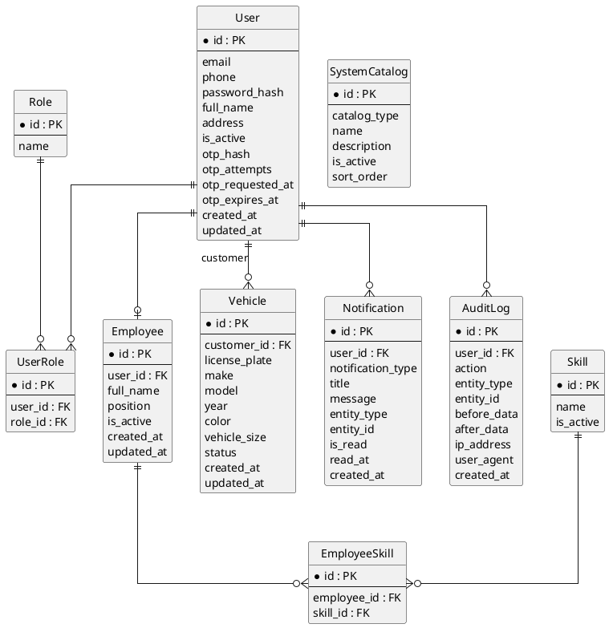

# System, Users & Assets ERD

```plantuml
@startuml
hide circle
skinparam linetype ortho

entity "User" as User {
  *id : PK
  --
  email
  phone
  password_hash
  full_name
  address
  is_active
  otp_hash
  otp_attempts
  otp_requested_at
  otp_expires_at
  created_at
  updated_at
}

entity "Role" as Role {
  *id : PK
  --
  name
}

entity "UserRole" as UserRole {
  *id : PK
  --
  user_id : FK
  role_id : FK
}

entity "Employee" as Employee {
  *id : PK
  --
  user_id : FK
  full_name
  position
  is_active
  created_at
  updated_at
}

entity "Skill" as Skill {
  *id : PK
  --
  name
  is_active
}

entity "EmployeeSkill" as EmployeeSkill {
  *id : PK
  --
  employee_id : FK
  skill_id : FK
}

entity "Vehicle" as Vehicle {
  *id : PK
  --
  customer_id : FK
  license_plate
  make
  model
  year
  color
  vehicle_size
  status
  created_at
  updated_at
}

entity "SystemCatalog" as SystemCatalog {
  *id : PK
  --
  catalog_type
  name
  description
  is_active
  sort_order
}

entity "Notification" as Notification {
  *id : PK
  --
  user_id : FK
  notification_type
  title
  message
  entity_type
  entity_id
  is_read
  read_at
  created_at
}

entity "AuditLog" as AuditLog {
  *id : PK
  --
  user_id : FK
  action
  entity_type
  entity_id
  before_data
  after_data
  ip_address
  user_agent
  created_at
}

' Relationships
User ||--o{ UserRole
Role ||--o{ UserRole
User ||--o| Employee
Employee ||--o{ EmployeeSkill
Skill ||--o{ EmployeeSkill
User ||--o{ Vehicle : "customer"
User ||--o{ Notification
User ||--o{ AuditLog

@enduml
```
