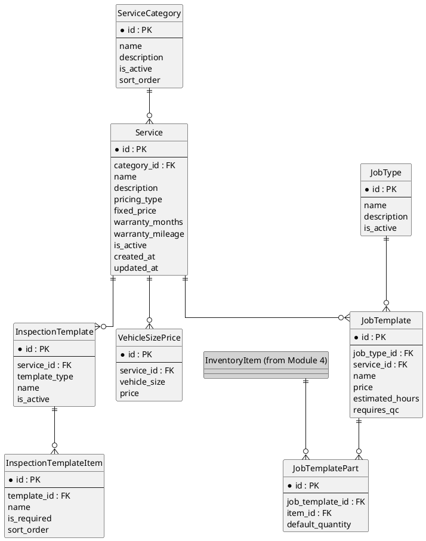

# Service Catalog ERD

```plantuml
@startuml
hide circle
skinparam linetype ortho

entity "ServiceCategory" as ServiceCategory {
  *id : PK
  --
  name
  description
  is_active
  sort_order
}

entity "Service" as Service {
  *id : PK
  --
  category_id : FK
  name
  description
  pricing_type
  fixed_price
  warranty_months
  warranty_mileage
  is_active
  created_at
  updated_at
}

entity "VehicleSizePrice" as VehicleSizePrice {
  *id : PK
  --
  service_id : FK
  vehicle_size
  price
}

entity "JobType" as JobType {
  *id : PK
  --
  name
  description
  is_active
}

entity "JobTemplate" as JobTemplate {
  *id : PK
  --
  job_type_id : FK
  service_id : FK
  name
  price
  estimated_hours
  requires_qc
}

entity "JobTemplatePart" as JobTemplatePart {
  *id : PK
  --
  job_template_id : FK
  item_id : FK
  default_quantity
}

entity "InspectionTemplate" as InspectionTemplate {
  *id : PK
  --
  service_id : FK
  template_type
  name
  is_active
}

entity "InspectionTemplateItem" as InspectionTemplateItem {
  *id : PK
  --
  template_id : FK
  name
  is_required
  sort_order
}

' External references
entity "InventoryItem (from Module 4)" as InventoryItem #lightgrey

' Relationships
ServiceCategory ||--o{ Service
Service ||--o{ VehicleSizePrice
JobType ||--o{ JobTemplate
Service ||--o{ JobTemplate
JobTemplate ||--o{ JobTemplatePart
InventoryItem ||--o{ JobTemplatePart
Service ||--o{ InspectionTemplate
InspectionTemplate ||--o{ InspectionTemplateItem

@enduml
```
