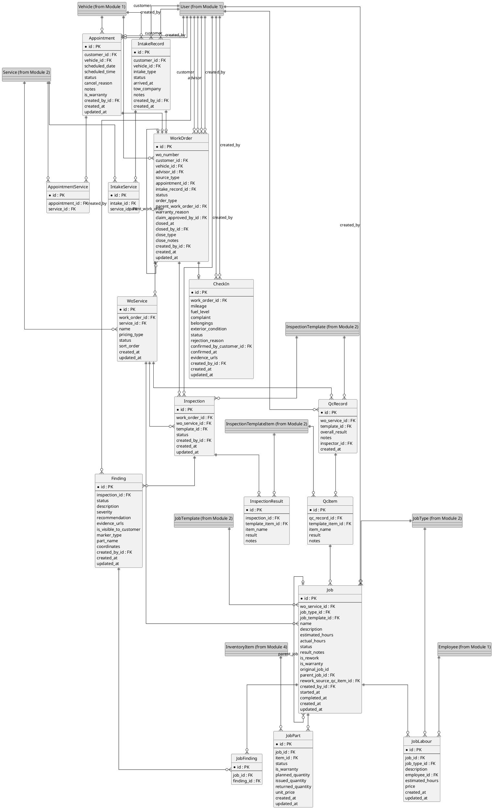

# Operations & Execution ERD

```plantuml
@startuml
hide circle
skinparam linetype ortho

entity "Appointment" as Appointment {
  *id : PK
  --
  customer_id : FK
  vehicle_id : FK
  scheduled_date
  scheduled_time
  status
  cancel_reason
  notes
  is_warranty
  created_by_id : FK
  created_at
  updated_at
}

entity "AppointmentService" as AppointmentService {
  *id : PK
  --
  appointment_id : FK
  service_id : FK
}

entity "IntakeRecord" as IntakeRecord {
  *id : PK
  --
  customer_id : FK
  vehicle_id : FK
  intake_type
  status
  arrived_at
  tow_company
  notes
  created_by_id : FK
  created_at
}

entity "IntakeService" as IntakeService {
  *id : PK
  --
  intake_id : FK
  service_id : FK
}

entity "WorkOrder" as WorkOrder {
  *id : PK
  --
  wo_number
  customer_id : FK
  vehicle_id : FK
  advisor_id : FK
  source_type
  appointment_id : FK
  intake_record_id : FK
  status
  order_type
  parent_work_order_id : FK
  warranty_reason
  claim_approved_by_id : FK
  closed_at
  closed_by_id : FK
  close_type
  close_notes
  created_by_id : FK
  created_at
  updated_at
}

entity "CheckIn" as CheckIn {
  *id : PK
  --
  work_order_id : FK
  mileage
  fuel_level
  complaint
  belongings
  exterior_condition
  status
  rejection_reason
  confirmed_by_customer_id : FK
  confirmed_at
  evidence_urls
  created_by_id : FK
  created_at
  updated_at
}

entity "WoService" as WoService {
  *id : PK
  --
  work_order_id : FK
  service_id : FK
  name
  pricing_type
  status
  sort_order
  created_at
  updated_at
}

entity "Inspection" as Inspection {
  *id : PK
  --
  work_order_id : FK
  wo_service_id : FK
  template_id : FK
  status
  created_by_id : FK
  created_at
  updated_at
}

entity "InspectionResult" as InspectionResult {
  *id : PK
  --
  inspection_id : FK
  template_item_id : FK
  item_name
  result
  notes
}

entity "Finding" as Finding {
  *id : PK
  --
  inspection_id : FK
  status
  description
  severity
  recommendation
  evidence_urls
  is_visible_to_customer
  marker_type
  part_name
  coordinates
  created_by_id : FK
  created_at
  updated_at
}

entity "Job" as Job {
  *id : PK
  --
  wo_service_id : FK
  job_type_id : FK
  job_template_id : FK
  name
  description
  estimated_hours
  actual_hours
  status
  result_notes
  is_rework
  is_warranty
  original_job_id
  parent_job_id : FK
  rework_source_qc_item_id : FK
  created_by_id : FK
  started_at
  completed_at
  created_at
  updated_at
}

entity "JobFinding" as JobFinding {
  *id : PK
  --
  job_id : FK
  finding_id : FK
}

entity "JobLabour" as JobLabour {
  *id : PK
  --
  job_id : FK
  job_type_id : FK
  description
  employee_id : FK
  estimated_hours
  price
  created_at
  updated_at
}

entity "JobPart" as JobPart {
  *id : PK
  --
  job_id : FK
  item_id : FK
  status
  is_warranty
  planned_quantity
  issued_quantity
  returned_quantity
  unit_price
  created_at
  updated_at
}

entity "QcRecord" as QcRecord {
  *id : PK
  --
  wo_service_id : FK
  template_id : FK
  overall_result
  notes
  inspector_id : FK
  created_at
}

entity "QcItem" as QcItem {
  *id : PK
  --
  qc_record_id : FK
  template_item_id : FK
  item_name
  result
  notes
}

' External references
entity "User (from Module 1)" as User #lightgrey
entity "Vehicle (from Module 1)" as Vehicle #lightgrey
entity "Employee (from Module 1)" as Employee #lightgrey
entity "Service (from Module 2)" as Service #lightgrey
entity "JobType (from Module 2)" as JobType #lightgrey
entity "JobTemplate (from Module 2)" as JobTemplate #lightgrey
entity "InspectionTemplate (from Module 2)" as InspectionTemplate #lightgrey
entity "InspectionTemplateItem (from Module 2)" as InspectionTemplateItem #lightgrey
entity "InventoryItem (from Module 4)" as InventoryItem #lightgrey

' Relationships
User ||--o{ Appointment : "customer"
User ||--o{ Appointment : "created_by"
Vehicle ||--o{ Appointment
Appointment ||--o{ AppointmentService
Service ||--o{ AppointmentService
User ||--o{ IntakeRecord : "customer"
User ||--o{ IntakeRecord : "created_by"
Vehicle ||--o{ IntakeRecord
IntakeRecord ||--o{ IntakeService
Service ||--o{ IntakeService
User ||--o{ WorkOrder : "customer"
User ||--o{ WorkOrder
Vehicle ||--o{ WorkOrder
User ||--o{ WorkOrder : "advisor"
User ||--o{ WorkOrder : "created_by"
Appointment ||--o| WorkOrder
IntakeRecord ||--o| WorkOrder
WorkOrder |o--o{ WorkOrder : "parent_work_order"
WorkOrder ||--o| CheckIn
User ||--o{ CheckIn
User ||--o{ CheckIn : "created_by"
WorkOrder ||--o{ WoService
Service ||--o{ WoService
WorkOrder ||--o{ Inspection
WoService ||--o{ Inspection
InspectionTemplate ||--o{ Inspection
User ||--o{ Inspection : "created_by"
Inspection ||--o{ InspectionResult
InspectionTemplateItem ||--o{ InspectionResult
Inspection ||--o{ Finding
User ||--o{ Finding : "created_by"
WoService ||--o{ Job
JobType ||--o{ Job
JobTemplate ||--o{ Job
Job |o--o{ Job : "parent_job"
QcItem ||--o{ Job
User ||--o{ Job : "created_by"
Job ||--o{ JobFinding
Finding ||--o{ JobFinding
Job ||--o{ JobLabour
JobType ||--o{ JobLabour
Employee ||--o{ JobLabour
Job ||--o{ JobPart
InventoryItem ||--o{ JobPart
WoService ||--o{ QcRecord
InspectionTemplate ||--o{ QcRecord
User ||--o{ QcRecord
QcRecord ||--o{ QcItem
InspectionTemplateItem ||--o{ QcItem

@enduml
```
