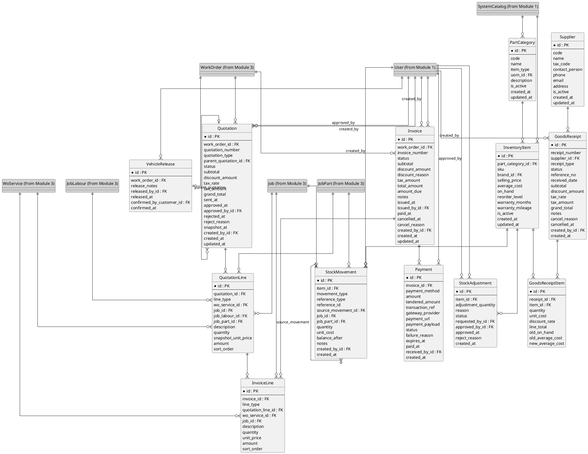

# Finance & Inventory ERD

```plantuml
@startuml
hide circle
skinparam linetype ortho

entity "Quotation" as Quotation {
  *id : PK
  --
  work_order_id : FK
  quotation_number
  quotation_type
  parent_quotation_id : FK
  status
  subtotal
  discount_amount
  tax_rate
  tax_amount
  grand_total
  sent_at
  approved_at
  approved_by_id : FK
  rejected_at
  reject_reason
  snapshot_at
  created_by_id : FK
  created_at
  updated_at
}

entity "QuotationLine" as QuotationLine {
  *id : PK
  --
  quotation_id : FK
  line_type
  wo_service_id : FK
  job_id : FK
  job_labour_id : FK
  job_part_id : FK
  description
  quantity
  snapshot_unit_price
  amount
  sort_order
}

entity "Invoice" as Invoice {
  *id : PK
  --
  work_order_id : FK
  invoice_number
  status
  subtotal
  discount_amount
  discount_reason
  tax_amount
  total_amount
  amount_due
  notes
  issued_at
  issued_by_id : FK
  paid_at
  cancelled_at
  cancel_reason
  created_by_id : FK
  created_at
  updated_at
}

entity "InvoiceLine" as InvoiceLine {
  *id : PK
  --
  invoice_id : FK
  line_type
  quotation_line_id : FK
  wo_service_id : FK
  job_id : FK
  description
  quantity
  unit_price
  amount
  sort_order
}

entity "Payment" as Payment {
  *id : PK
  --
  invoice_id : FK
  payment_method
  amount
  tendered_amount
  transaction_ref
  gateway_provider
  payment_url
  payment_payload
  status
  failure_reason
  expires_at
  paid_at
  received_by_id : FK
  created_at
}

entity "VehicleRelease" as VehicleRelease {
  *id : PK
  --
  work_order_id : FK
  release_notes
  released_by_id : FK
  released_at
  confirmed_by_customer_id : FK
  confirmed_at
}

entity "Supplier" as Supplier {
  *id : PK
  --
  code
  name
  tax_code
  contact_person
  phone
  email
  address
  is_active
  created_at
  updated_at
}

entity "PartCategory" as PartCategory {
  *id : PK
  --
  code
  name
  item_type
  uom_id : FK
  description
  is_active
  created_at
  updated_at
}

entity "InventoryItem" as InventoryItem {
  *id : PK
  --
  part_category_id : FK
  sku
  brand_id : FK
  selling_price
  average_cost
  on_hand
  reorder_level
  warranty_months
  warranty_mileage
  is_active
  created_at
  updated_at
}

entity "GoodsReceipt" as GoodsReceipt {
  *id : PK
  --
  receipt_number
  supplier_id : FK
  receipt_type
  status
  reference_no
  received_date
  subtotal
  discount_amount
  tax_rate
  tax_amount
  grand_total
  notes
  cancel_reason
  cancelled_at
  created_by_id : FK
  created_at
}

entity "GoodsReceiptItem" as GoodsReceiptItem {
  *id : PK
  --
  receipt_id : FK
  item_id : FK
  quantity
  unit_cost
  discount_rate
  line_total
  old_on_hand
  old_average_cost
  new_average_cost
}

entity "StockMovement" as StockMovement {
  *id : PK
  --
  item_id : FK
  movement_type
  reference_type
  reference_id
  source_movement_id : FK
  job_id : FK
  job_part_id : FK
  quantity
  unit_cost
  balance_after
  notes
  created_by_id : FK
  created_at
}

entity "StockAdjustment" as StockAdjustment {
  *id : PK
  --
  item_id : FK
  adjustment_quantity
  reason
  status
  requested_by_id : FK
  approved_by_id : FK
  approved_at
  reject_reason
  created_at
}

' External references
entity "User (from Module 1)" as User #lightgrey
entity "SystemCatalog (from Module 1)" as SystemCatalog #lightgrey
entity "WorkOrder (from Module 3)" as WorkOrder #lightgrey
entity "WoService (from Module 3)" as WoService #lightgrey
entity "Job (from Module 3)" as Job #lightgrey
entity "JobLabour (from Module 3)" as JobLabour #lightgrey
entity "JobPart (from Module 3)" as JobPart #lightgrey

' Relationships
WorkOrder ||--o{ Quotation
Quotation |o--o{ Quotation : "parent_quotation"
User ||--o{ Quotation : "approved_by"
User ||--o{ Quotation : "created_by"
Quotation ||--o{ QuotationLine
WoService ||--o{ QuotationLine
Job ||--o{ QuotationLine
JobLabour ||--o{ QuotationLine
JobPart ||--o{ QuotationLine
WorkOrder ||--o{ Invoice
User ||--o{ Invoice : "created_by"
User ||--o{ Invoice
Invoice ||--o{ InvoiceLine
QuotationLine ||--o{ InvoiceLine
WoService ||--o{ InvoiceLine
Job ||--o{ InvoiceLine
Invoice ||--o{ Payment
User ||--o{ Payment
WorkOrder ||--o| VehicleRelease
User ||--o{ VehicleRelease
SystemCatalog ||--o{ PartCategory
PartCategory ||--o{ InventoryItem
SystemCatalog ||--o{ InventoryItem
Supplier ||--o{ GoodsReceipt
User ||--o{ GoodsReceipt : "created_by"
GoodsReceipt ||--o{ GoodsReceiptItem
InventoryItem ||--o{ GoodsReceiptItem
InventoryItem ||--o{ StockMovement
StockMovement |o--o{ StockMovement : "source_movement"
Job ||--o{ StockMovement
JobPart ||--o{ StockMovement
User ||--o{ StockMovement : "created_by"
InventoryItem ||--o{ StockAdjustment
User ||--o{ StockAdjustment
User ||--o{ StockAdjustment : "approved_by"

@enduml
```
