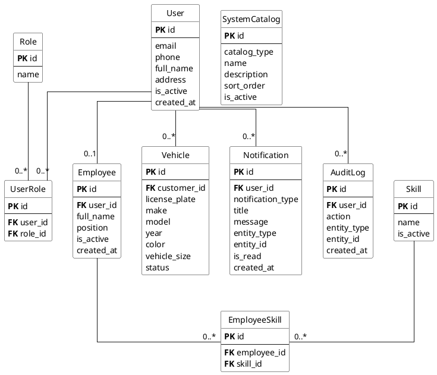

# UML: System, Users & Assets

```plantuml
@startuml
hide circle
skinparam classBackgroundColor white
skinparam linetype ortho

entity "User" {
  **PK** id
  --
  email
  phone
  full_name
  address
  is_active
  created_at
}

entity "Role" {
  **PK** id
  --
  name
}

entity "UserRole" {
  **PK** id
  --
  **FK** user_id
  **FK** role_id
}

entity "Employee" {
  **PK** id
  --
  **FK** user_id
  full_name
  position
  is_active
  created_at
}

entity "Skill" {
  **PK** id
  --
  name
  is_active
}

entity "EmployeeSkill" {
  **PK** id
  --
  **FK** employee_id
  **FK** skill_id
}

entity "Vehicle" {
  **PK** id
  --
  **FK** customer_id
  license_plate
  make
  model
  year
  color
  vehicle_size
  status
}

entity "SystemCatalog" {
  **PK** id
  --
  catalog_type
  name
  description
  sort_order
  is_active
}

entity "Notification" {
  **PK** id
  --
  **FK** user_id
  notification_type
  title
  message
  entity_type
  entity_id
  is_read
  created_at
}

entity "AuditLog" {
  **PK** id
  --
  **FK** user_id
  action
  entity_type
  entity_id
  created_at
}

' Relationships
"User" -- "0..*" "UserRole"
"Role" -- "0..*" "UserRole"
"User" -- "0..1" "Employee"
"Employee" -- "0..*" "EmployeeSkill"
"Skill" -- "0..*" "EmployeeSkill"
"User" -- "0..*" "Vehicle"
"User" -- "0..*" "Notification"
"User" -- "0..*" "AuditLog"

@enduml
```
