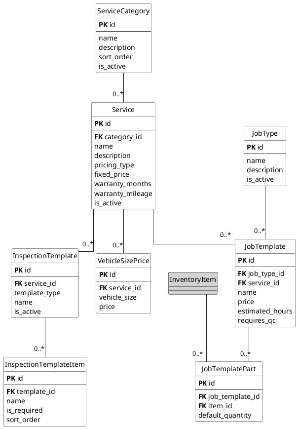

# UML: Service Catalog

```plantuml
@startuml
hide circle
skinparam classBackgroundColor white
skinparam linetype ortho

entity "ServiceCategory" {
  **PK** id
  --
  name
  description
  sort_order
  is_active
}

entity "Service" {
  **PK** id
  --
  **FK** category_id
  name
  description
  pricing_type
  fixed_price
  warranty_months
  warranty_mileage
  is_active
}

entity "VehicleSizePrice" {
  **PK** id
  --
  **FK** service_id
  vehicle_size
  price
}

entity "JobType" {
  **PK** id
  --
  name
  description
  is_active
}

entity "JobTemplate" {
  **PK** id
  --
  **FK** job_type_id
  **FK** service_id
  name
  price
  estimated_hours
  requires_qc
}

entity "JobTemplatePart" {
  **PK** id
  --
  **FK** job_template_id
  **FK** item_id
  default_quantity
}

entity "InspectionTemplate" {
  **PK** id
  --
  **FK** service_id
  template_type
  name
  is_active
}

entity "InspectionTemplateItem" {
  **PK** id
  --
  **FK** template_id
  name
  is_required
  sort_order
}

' External references
entity "InventoryItem" as InventoryItem #lightgrey

' Relationships
"ServiceCategory" -- "0..*" "Service"
"Service" -- "0..*" "VehicleSizePrice"
"Service" -- "0..*" "JobTemplate"
"JobType" -- "0..*" "JobTemplate"
"JobTemplate" -- "0..*" "JobTemplatePart"
"InventoryItem" -- "0..*" "JobTemplatePart"
"Service" -- "0..*" "InspectionTemplate"
"InspectionTemplate" -- "0..*" "InspectionTemplateItem"

@enduml
```
