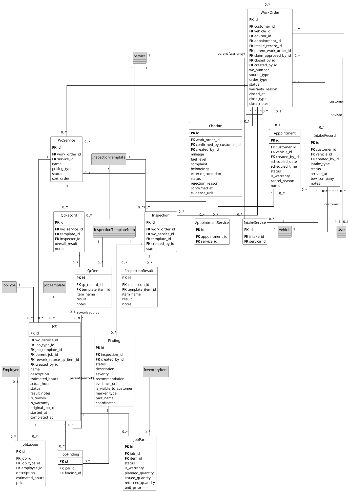

# UML: Operations & Execution

```plantuml
@startuml
hide circle
skinparam classBackgroundColor white
skinparam linetype ortho

entity "Appointment" {
  **PK** id
  --
  **FK** customer_id
  **FK** vehicle_id
  **FK** created_by_id
  scheduled_date
  scheduled_time
  status
  is_warranty
  cancel_reason
  notes
}

entity "AppointmentService" {
  **PK** id
  --
  **FK** appointment_id
  **FK** service_id
}

entity "IntakeRecord" {
  **PK** id
  --
  **FK** customer_id
  **FK** vehicle_id
  **FK** created_by_id
  intake_type
  status
  arrived_at
  tow_company
  notes
}

entity "IntakeService" {
  **PK** id
  --
  **FK** intake_id
  **FK** service_id
}

entity "WorkOrder" {
  **PK** id
  --
  **FK** customer_id
  **FK** vehicle_id
  **FK** advisor_id
  **FK** appointment_id
  **FK** intake_record_id
  **FK** parent_work_order_id
  **FK** claim_approved_by_id
  **FK** closed_by_id
  **FK** created_by_id
  wo_number
  source_type
  order_type
  status
  warranty_reason
  closed_at
  close_type
  close_notes
}

entity "CheckIn" {
  **PK** id
  --
  **FK** work_order_id
  **FK** confirmed_by_customer_id
  **FK** created_by_id
  mileage
  fuel_level
  complaint
  belongings
  exterior_condition
  status
  rejection_reason
  confirmed_at
  evidence_urls
}

entity "WoService" {
  **PK** id
  --
  **FK** work_order_id
  **FK** service_id
  name
  pricing_type
  status
  sort_order
}

entity "Inspection" {
  **PK** id
  --
  **FK** work_order_id
  **FK** wo_service_id
  **FK** template_id
  **FK** created_by_id
  status
}

entity "InspectionResult" {
  **PK** id
  --
  **FK** inspection_id
  **FK** template_item_id
  item_name
  result
  notes
}

entity "Finding" {
  **PK** id
  --
  **FK** inspection_id
  **FK** created_by_id
  status
  description
  severity
  recommendation
  evidence_urls
  is_visible_to_customer
  marker_type
  part_name
  coordinates
}

entity "Job" {
  **PK** id
  --
  **FK** wo_service_id
  **FK** job_type_id
  **FK** job_template_id
  **FK** parent_job_id
  **FK** rework_source_qc_item_id
  **FK** created_by_id
  name
  description
  estimated_hours
  actual_hours
  status
  result_notes
  is_rework
  is_warranty
  original_job_id
  started_at
  completed_at
}

entity "JobFinding" {
  **PK** id
  --
  **FK** job_id
  **FK** finding_id
}

entity "JobLabour" {
  **PK** id
  --
  **FK** job_id
  **FK** job_type_id
  **FK** employee_id
  description
  estimated_hours
  price
}

entity "JobPart" {
  **PK** id
  --
  **FK** job_id
  **FK** item_id
  status
  is_warranty
  planned_quantity
  issued_quantity
  returned_quantity
  unit_price
}

entity "QcRecord" {
  **PK** id
  --
  **FK** wo_service_id
  **FK** template_id
  **FK** inspector_id
  overall_result
  notes
}

entity "QcItem" {
  **PK** id
  --
  **FK** qc_record_id
  **FK** template_item_id
  item_name
  result
  notes
}

' External references
entity "User" as User #lightgrey
entity "Vehicle" as Vehicle #lightgrey
entity "Service" as Service #lightgrey
entity "JobType" as JobType #lightgrey
entity "JobTemplate" as JobTemplate #lightgrey
entity "InspectionTemplate" as InspectionTemplate #lightgrey
entity "InspectionTemplateItem" as InspectionTemplateItem #lightgrey
entity "InventoryItem" as InventoryItem #lightgrey
entity "Employee" as Employee #lightgrey

' Relationships
Appointment "0..*" -- "1" User : customer
Appointment "0..*" -- "1" Vehicle
Appointment "1" -- "0..*" AppointmentService
Service "1" -- "0..*" AppointmentService

IntakeRecord "0..*" -- "1" User : customer
IntakeRecord "0..*" -- "1" Vehicle
IntakeRecord "1" -- "0..*" IntakeService
Service "1" -- "0..*" IntakeService

WorkOrder "0..*" -- "1" User : customer
WorkOrder "0..*" -- "1" Vehicle
WorkOrder "0..*" -- "0..1" User : advisor
WorkOrder "0..1" -- "0..1" Appointment
WorkOrder "0..1" -- "0..1" IntakeRecord
WorkOrder "0..*" -- "0..1" WorkOrder : parent (warranty)

WorkOrder "1" -- "0..1" CheckIn

WorkOrder "1" -- "0..*" WoService
Service "1" -- "0..*" WoService

WorkOrder "1" -- "0..*" Inspection
WoService "0..1" -- "0..*" Inspection
InspectionTemplate "1" -- "0..*" Inspection
Inspection "1" -- "0..*" InspectionResult
InspectionTemplateItem "1" -- "0..*" InspectionResult
Inspection "1" -- "0..*" Finding

WoService "1" -- "0..*" Job
JobType "1" -- "0..*" Job
JobTemplate "0..1" -- "0..*" Job
Job "0..*" -- "0..1" Job : parent (rework)
Job "1" -- "0..*" JobFinding
Finding "1" -- "0..*" JobFinding

Job "1" -- "0..*" JobLabour
Employee "0..1" -- "0..*" JobLabour

Job "1" -- "0..*" JobPart
InventoryItem "1" -- "0..*" JobPart

WoService "1" -- "0..*" QcRecord
InspectionTemplate "1" -- "0..*" QcRecord
QcRecord "1" -- "0..*" QcItem
InspectionTemplateItem "1" -- "0..*" QcItem
QcItem "0..1" -- "0..*" Job : rework source

@enduml
```
