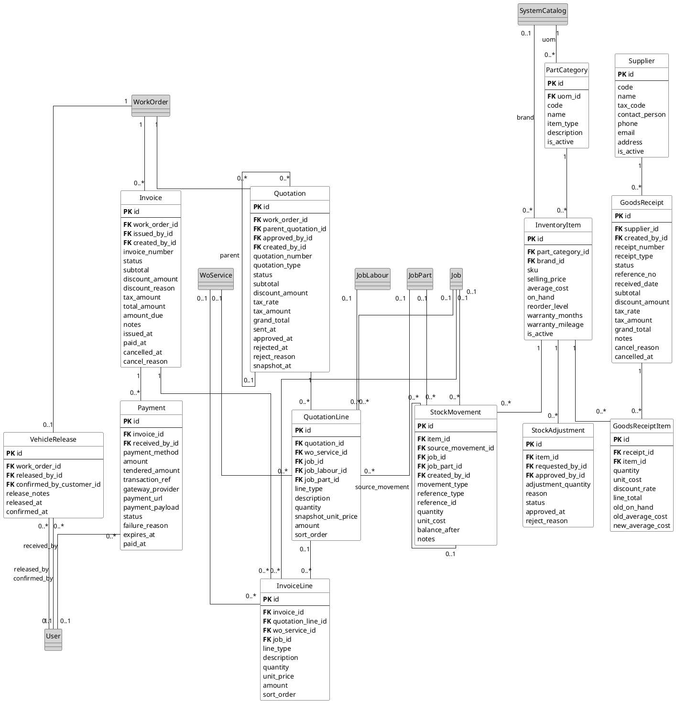

# UML: Finance & Inventory

```plantuml
@startuml
hide circle
skinparam classBackgroundColor white
skinparam linetype ortho

entity "Quotation" {
  **PK** id
  --
  **FK** work_order_id
  **FK** parent_quotation_id
  **FK** approved_by_id
  **FK** created_by_id
  quotation_number
  quotation_type
  status
  subtotal
  discount_amount
  tax_rate
  tax_amount
  grand_total
  sent_at
  approved_at
  rejected_at
  reject_reason
  snapshot_at
}

entity "QuotationLine" {
  **PK** id
  --
  **FK** quotation_id
  **FK** wo_service_id
  **FK** job_id
  **FK** job_labour_id
  **FK** job_part_id
  line_type
  description
  quantity
  snapshot_unit_price
  amount
  sort_order
}

entity "Invoice" {
  **PK** id
  --
  **FK** work_order_id
  **FK** issued_by_id
  **FK** created_by_id
  invoice_number
  status
  subtotal
  discount_amount
  discount_reason
  tax_amount
  total_amount
  amount_due
  notes
  issued_at
  paid_at
  cancelled_at
  cancel_reason
}

entity "InvoiceLine" {
  **PK** id
  --
  **FK** invoice_id
  **FK** quotation_line_id
  **FK** wo_service_id
  **FK** job_id
  line_type
  description
  quantity
  unit_price
  amount
  sort_order
}

entity "Payment" {
  **PK** id
  --
  **FK** invoice_id
  **FK** received_by_id
  payment_method
  amount
  tendered_amount
  transaction_ref
  gateway_provider
  payment_url
  payment_payload
  status
  failure_reason
  expires_at
  paid_at
}

entity "VehicleRelease" {
  **PK** id
  --
  **FK** work_order_id
  **FK** released_by_id
  **FK** confirmed_by_customer_id
  release_notes
  released_at
  confirmed_at
}

entity "Supplier" {
  **PK** id
  --
  code
  name
  tax_code
  contact_person
  phone
  email
  address
  is_active
}

entity "PartCategory" {
  **PK** id
  --
  **FK** uom_id
  code
  name
  item_type
  description
  is_active
}

entity "InventoryItem" {
  **PK** id
  --
  **FK** part_category_id
  **FK** brand_id
  sku
  selling_price
  average_cost
  on_hand
  reorder_level
  warranty_months
  warranty_mileage
  is_active
}

entity "GoodsReceipt" {
  **PK** id
  --
  **FK** supplier_id
  **FK** created_by_id
  receipt_number
  receipt_type
  status
  reference_no
  received_date
  subtotal
  discount_amount
  tax_rate
  tax_amount
  grand_total
  notes
  cancel_reason
  cancelled_at
}

entity "GoodsReceiptItem" {
  **PK** id
  --
  **FK** receipt_id
  **FK** item_id
  quantity
  unit_cost
  discount_rate
  line_total
  old_on_hand
  old_average_cost
  new_average_cost
}

entity "StockMovement" {
  **PK** id
  --
  **FK** item_id
  **FK** source_movement_id
  **FK** job_id
  **FK** job_part_id
  **FK** created_by_id
  movement_type
  reference_type
  reference_id
  quantity
  unit_cost
  balance_after
  notes
}

entity "StockAdjustment" {
  **PK** id
  --
  **FK** item_id
  **FK** requested_by_id
  **FK** approved_by_id
  adjustment_quantity
  reason
  status
  approved_at
  reject_reason
}

' External references
entity "WorkOrder" as WorkOrder #lightgrey
entity "WoService" as WoService #lightgrey
entity "Job" as Job #lightgrey
entity "JobLabour" as JobLabour #lightgrey
entity "JobPart" as JobPart #lightgrey
entity "User" as User #lightgrey
entity "SystemCatalog" as SystemCatalog #lightgrey

' Relationships
WorkOrder "1" -- "0..*" Quotation
Quotation "0..*" -- "0..1" Quotation : parent
Quotation "1" -- "0..*" QuotationLine
WoService "0..1" -- "0..*" QuotationLine
Job "0..1" -- "0..*" QuotationLine
JobLabour "0..1" -- "0..*" QuotationLine
JobPart "0..1" -- "0..*" QuotationLine

WorkOrder "1" -- "0..*" Invoice
Invoice "1" -- "0..*" InvoiceLine
QuotationLine "0..1" -- "0..*" InvoiceLine
WoService "0..1" -- "0..*" InvoiceLine
Job "0..1" -- "0..*" InvoiceLine

Invoice "1" -- "0..*" Payment
Payment "0..*" -- "0..1" User : received_by

WorkOrder "1" -- "0..1" VehicleRelease
VehicleRelease "0..*" -- "1" User : released_by
VehicleRelease "0..*" -- "0..1" User : confirmed_by

SystemCatalog "1" -- "0..*" PartCategory : uom
PartCategory "1" -- "0..*" InventoryItem
SystemCatalog "0..1" -- "0..*" InventoryItem : brand

Supplier "1" -- "0..*" GoodsReceipt
GoodsReceipt "1" -- "0..*" GoodsReceiptItem
InventoryItem "1" -- "0..*" GoodsReceiptItem

InventoryItem "1" -- "0..*" StockMovement
StockMovement "0..*" -- "0..1" StockMovement : source_movement
Job "0..1" -- "0..*" StockMovement
JobPart "0..1" -- "0..*" StockMovement

InventoryItem "1" -- "0..*" StockAdjustment

@enduml
```
