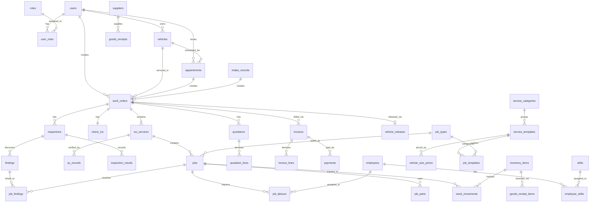

# Thiết kế Database – Hệ thống Quản lý Trung tâm Dịch vụ Ô tô

> **DBMS:** MySQL 8.x · **ORM:** Prisma · **PK:** INT AUTO_INCREMENT  
> **Nguồn:** [Requirement.md](file:///d:/TLCN/DESIGN%20DATABASE/Requirement.md) + [UseCase.md](file:///d:/TLCN/DESIGN%20DATABASE/UseCase.md)  
> **Phương pháp:** [database-schema-designer](file:///d:/TLCN/DESIGN%20DATABASE/database-schema-designer/SKILL.md) + [database-designer](file:///d:/TLCN/DESIGN%20DATABASE/database-designer/SKILL.md)

---

## User Review Required

> [!IMPORTANT]
> Bản thiết kế này gồm **~43 bảng**, phân theo **10 nhóm component** từ yêu cầu nghiệp vụ. Xin review các quyết định thiết kế dưới đây trước khi thực hiện.

> [!WARNING]
> **Snapshot strategy:** Quotation lines lưu `snapshot_unit_price` tại thời điểm gửi/duyệt. Invoice lines truy vết ngược về Quotation line.

---

## Resolved Decisions

| # | Câu hỏi | Quyết định |
|---|---------|------------|
| 1 | **Media/Evidence** | **Không dùng bảng riêng.** Lưu trực tiếp Cloudinary URL dạng `JSON` array trong cột `evidence_urls` của `check_ins` và `findings`. Mỗi phần tử là một URL string. |
| 2 | **Notification** | Bảng `notifications` lưu trực tiếp trên DB với `notification_type`, `entity_type/entity_id` để deep-link. |
| 3 | **Audit Log** | Bảng `audit_logs` lưu trực tiếp trên DB, ghi `before_data` / `after_data` dạng JSON cho Work Order, Quotation, Invoice, Stock Movement và các entity quan trọng. |

---

## Proposed Changes

### Quy ước chung (Cross-Cutting Concerns)

Áp dụng theo skill [schema-design-and-security.md](file:///d:/TLCN/DESIGN%20DATABASE/database-schema-designer/references/schema-design-and-security.md):

- **Mọi bảng đều có:** `id INT AUTO_INCREMENT PRIMARY KEY`, `created_at DATETIME DEFAULT CURRENT_TIMESTAMP`, `updated_at DATETIME DEFAULT CURRENT_TIMESTAMP ON UPDATE CURRENT_TIMESTAMP`
- **Bảng có soft-delete:** thêm `deleted_at DATETIME NULL`
- **Bảng auditable:** thêm `created_by_id INT NULL FK(users)`, `updated_by_id INT NULL FK(users)`
- **Naming:** snake_case cho bảng và cột; Prisma model sẽ map `@@map("table_name")`
- **ENUM:** Dùng MySQL `ENUM()` cho status fields có tập giá trị cố định (MySQL native ENUM hiệu quả hơn varchar + CHECK)
- **Index FK:** Mọi cột foreign key đều có index (theo [best-practices](file:///d:/TLCN/DESIGN%20DATABASE/database-schema-designer/references/best-practices-and-troubleshooting.md))
- **Decimal:** Dùng `DECIMAL(12,2)` cho tiền tệ, `DECIMAL(10,4)` cho số lượng cần độ chính xác cao

---

### Component 1 — Identity & Access (FR-01)

> UC-02 Register · UC-03 Login · UC-04 Logout · UC-05 Reset Password · UC-40 Manage Accounts · QĐ-ADM01 RBAC

#### `users`
| Cột | Kiểu | Ghi chú |
|-----|------|---------|
| id | INT AI PK | |
| email | VARCHAR(255) UNIQUE NOT NULL | Đăng nhập |
| phone | VARCHAR(20) UNIQUE NULL | Customer bắt buộc, Staff có thể NULL |
| password_hash | VARCHAR(255) NOT NULL | bcrypt/argon2 |
| full_name | VARCHAR(150) NOT NULL | |
| address | TEXT NULL | Customer profile |
| is_active | BOOLEAN DEFAULT TRUE | Khóa/mở khóa |
| otp_hash | VARCHAR(255) NULL | Hash của OTP reset password |
| otp_attempts | INT DEFAULT 0 | Đếm số lần nhập sai |
| otp_requested_at | DATETIME NULL | |
| otp_expires_at | DATETIME NULL | OTP 5 phút |
| created_at, updated_at | DATETIME | |

#### `roles`
| Cột | Kiểu | Ghi chú |
|-----|------|---------|
| id | INT AI PK | |
| name | VARCHAR(50) UNIQUE NOT NULL | CUSTOMER, FRONT_DESK, SERVICE_ADVISOR, SERVICE_MANAGER, ADMIN |
| description | VARCHAR(255) NULL | |

#### `user_roles` (junction — User *–* Role)
| Cột | Kiểu | Ghi chú |
|-----|------|---------|
| id | INT AI PK | |
| user_id | INT FK(users) NOT NULL | |
| role_id | INT FK(roles) NOT NULL | |
| UNIQUE(user_id, role_id) | | Một user nhiều role |

#### `employees`
| Cột | Kiểu | Ghi chú |
|-----|------|---------|
| id | INT AI PK | |
| user_id | INT FK(users) UNIQUE NULL | Employee có thể chưa có tài khoản |
| full_name | VARCHAR(150) NOT NULL | |
| position | ENUM('TECHNICIAN','DETAILER','QC_STAFF','ADVISOR','OTHER') NOT NULL | |
| is_active | BOOLEAN DEFAULT TRUE | |
| created_at, updated_at | DATETIME | |

#### `skills` (master data)
| Cột | Kiểu | Ghi chú |
|-----|------|---------|
| id | INT AI PK | |
| name | VARCHAR(100) NOT NULL | Ví dụ: Engine Repair, Brake System |
| is_active | BOOLEAN DEFAULT TRUE | |

#### `employee_skills` (junction)
| Cột | Kiểu | Ghi chú |
|-----|------|---------|
| id | INT AI PK | |
| employee_id | INT FK(employees) NOT NULL | |
| skill_id | INT FK(skills) NOT NULL | |
| UNIQUE(employee_id, skill_id) | | |

---

### Component 2 — Customer & Vehicle (FR-03)

> UC-06 Update Profile · UC-07 Manage Vehicles · UC-17 Manage Customer Profile · QĐ-CUS04

#### `vehicles`
| Cột | Kiểu | Ghi chú |
|-----|------|---------|
| id | INT AI PK | |
| customer_id | INT FK(users) NOT NULL | Owner |
| license_plate | VARCHAR(20) UNIQUE NOT NULL | Biển số duy nhất toàn hệ thống |
| make | VARCHAR(100) NOT NULL | Hãng xe |
| model | VARCHAR(100) NOT NULL | Dòng xe |
| year | SMALLINT NULL | Năm sản xuất |
| color | VARCHAR(50) NULL | |
| vehicle_size | ENUM('SMALL','MEDIUM','LARGE','SUV','TRUCK') NOT NULL | Dùng cho pricing CT-PRICE04 |
| status | ENUM('ACTIVE','INACTIVE') DEFAULT 'ACTIVE' | Không xóa khi đã có WO |
| created_at, updated_at | DATETIME | |


---

### Component 3 — Service Catalog & Pricing (FR-02, FR-10)

> UC-01 Browse Website · UC-08 Browse Service Catalog · UC-42 Manage Service Catalog · UC-43 Configure Job Types · UC-44 Manage Pricing Policies · QĐ-ADM03..06

#### `service_categories`
| Cột | Kiểu | Ghi chú |
|-----|------|---------|
| id | INT AI PK | |
| name | VARCHAR(100) NOT NULL | REPAIR, MAINTENANCE, CAR_WASH, DETAILING |
| description | TEXT NULL | |
| is_active | BOOLEAN DEFAULT TRUE | |
| sort_order | INT DEFAULT 0 | |

#### `service_templates`
| Cột | Kiểu | Ghi chú |
|-----|------|---------|
| id | INT AI PK | |
| category_id | INT FK(service_categories) NOT NULL | |
| name | VARCHAR(150) NOT NULL | Ví dụ: "Bảo dưỡng 10.000km" |
| description | TEXT NULL | |
| pricing_type | ENUM('FIXED','VEHICLE_SIZE','LABOUR_PARTS') NOT NULL | CT-PRICE01..05 |
| fixed_price | DECIMAL(12,2) NULL | Khi pricing_type = FIXED |
| is_active | BOOLEAN DEFAULT TRUE | Chỉ Active hiển thị cho Customer |
| created_at, updated_at | DATETIME | |

#### `vehicle_size_prices` (giá theo kích thước xe cho dịch vụ)
| Cột | Kiểu | Ghi chú |
|-----|------|---------|
| id | INT AI PK | |
| service_template_id | INT FK(service_templates) NOT NULL | |
| vehicle_size | ENUM('SMALL','MEDIUM','LARGE','SUV','TRUCK') NOT NULL | |
| price | DECIMAL(12,2) NOT NULL | |
| UNIQUE(service_template_id, vehicle_size) | | |

#### `job_types`
| Cột | Kiểu | Ghi chú |
|-----|------|---------|
| id | INT AI PK | |
| name | VARCHAR(150) NOT NULL | |
| description | TEXT NULL | |
| hourly_rate | DECIMAL(12,2) NOT NULL | CT-PRICE01: Labour Amount = Hours × Rate |
| is_active | BOOLEAN DEFAULT TRUE | |

#### `job_templates`
| Cột | Kiểu | Ghi chú |
|-----|------|---------|
| id | INT AI PK | |
| job_type_id | INT FK(job_types) NOT NULL | |
| service_template_id | INT FK(service_templates) NULL | Sinh Job từ mẫu dịch vụ |
| name | VARCHAR(150) NOT NULL | |
| estimated_hours | DECIMAL(5,2) NOT NULL | |
| requires_qc | BOOLEAN DEFAULT TRUE | |

#### `job_template_parts` (phụ tùng mặc định của mẫu job)
| Cột | Kiểu | Ghi chú |
|-----|------|---------|
| id | INT AI PK | |
| job_template_id | INT FK(job_templates) NOT NULL | |
| item_id | INT FK(inventory_items) NOT NULL | |
| default_quantity | DECIMAL(10,2) NOT NULL | |

---

### Component 4 — Inspection & QC Templates (FR-07, FR-14)

> UC-45 Manage Inspection Templates · QĐ-ADM07

#### `inspection_templates`
| Cột | Kiểu | Ghi chú |
|-----|------|---------|
| id | INT AI PK | |
| service_template_id | INT FK(service_templates) NULL | NULL = áp dụng chung |
| template_type | ENUM('INSPECTION','QC') NOT NULL | Kiểm tra ban đầu vs Kiểm định chất lượng |
| name | VARCHAR(150) NOT NULL | |
| is_active | BOOLEAN DEFAULT TRUE | |

#### `inspection_template_items`
| Cột | Kiểu | Ghi chú |
|-----|------|---------|
| id | INT AI PK | |
| template_id | INT FK(inspection_templates) NOT NULL | |
| name | VARCHAR(255) NOT NULL | Tên hạng mục |
| is_required | BOOLEAN DEFAULT TRUE | |
| sort_order | INT DEFAULT 0 | |

---

### Component 5 — Appointment & Intake (FR-04)

> UC-09 Customer Manage Appointments · UC-15 FD Manage Appointments · UC-16 Receive Vehicle · QĐ-FDS01..02

#### `appointments`
| Cột | Kiểu | Ghi chú |
|-----|------|---------|
| id | INT AI PK | |
| customer_id | INT FK(users) NOT NULL | |
| vehicle_id | INT FK(vehicles) NOT NULL | |
| scheduled_date | DATE NOT NULL | |
| scheduled_time | TIME NOT NULL | |
| status | ENUM('REQUESTED','CONFIRMED','ARRIVED','CANCELLED') DEFAULT 'REQUESTED' | State machine |
| cancel_reason | TEXT NULL | Bắt buộc khi CANCELLED |
| notes | TEXT NULL | |
| created_by_id | INT FK(users) NULL | Customer hoặc FD Staff |
| created_at, updated_at | DATETIME | |

> **Ownership Validation:** Application layer phải đảm bảo `appointments.vehicle_id` thuộc sở hữu của `appointments.customer_id`.

#### `appointment_services` (dịch vụ mong muốn khi đặt lịch)
| Cột | Kiểu | Ghi chú |
|-----|------|---------|
| id | INT AI PK | |
| appointment_id | INT FK(appointments) NOT NULL | |
| service_template_id | INT FK(service_templates) NOT NULL | |

#### `intake_records` (Walk-in / Tow-in — nguồn tiếp nhận ngoài Appointment)
| Cột | Kiểu | Ghi chú |
|-----|------|---------|
| id | INT AI PK | |
| customer_id | INT FK(users) NOT NULL | |
| vehicle_id | INT FK(vehicles) NOT NULL | |
| intake_type | ENUM('WALK_IN','TOW_IN') NOT NULL | |
| status | ENUM('QUEUED','CONVERTED','CANCELLED') DEFAULT 'QUEUED' | |
| arrived_at | DATETIME NOT NULL | Thời điểm xe đến |
| tow_company | VARCHAR(255) NULL | Tên người/đơn vị bàn giao (Tow-in) |
| notes | TEXT NULL | Nhu cầu dịch vụ |
| created_by_id | INT FK(users) NOT NULL | FD Staff |
| created_at | DATETIME | |

---

### Component 6 — Work Order Core (FR-05, FR-06, FR-07, FR-08, FR-09)

> UC-21..27 · QĐ-SA01..08 · **Trung tâm của toàn bộ hệ thống**

#### `work_orders`
| Cột | Kiểu | Ghi chú |
|-----|------|---------|
| id | INT AI PK | |
| wo_number | VARCHAR(20) UNIQUE NOT NULL | Mã phiếu auto-generate (VD: WO-20260908-001) |
| customer_id | INT FK(users) NOT NULL | |
| vehicle_id | INT FK(vehicles) NOT NULL | |
| advisor_id | INT FK(users) NOT NULL | Service Advisor phụ trách |
| source_type | ENUM('APPOINTMENT','WALK_IN','TOW_IN') NOT NULL | Nguồn tiếp nhận |
| appointment_id | INT FK(appointments) UNIQUE NULL | |
| intake_record_id | INT FK(intake_records) UNIQUE NULL | |
| status | ENUM('OPEN','IN_PROGRESS','PENDING_PAYMENT','RELEASED','CLOSED') DEFAULT 'OPEN' | |
| created_by_id | INT FK(users) NOT NULL | |
| created_at, updated_at | DATETIME | |

> **Work Order Constraints:** 
> - `UNIQUE(appointment_id)` và `UNIQUE(intake_record_id)` chống tạo nhiều WO từ 1 nguồn.
> - `CHECK (source_type = 'APPOINTMENT' AND appointment_id IS NOT NULL AND intake_record_id IS NULL) OR (source_type IN ('WALK_IN','TOW_IN') AND appointment_id IS NULL AND intake_record_id IS NOT NULL)`

#### `check_ins` (UC-22 Record Vehicle Condition — 1:1 với WO)
| Cột | Kiểu | Ghi chú |
|-----|------|---------|
| id | INT AI PK | |
| work_order_id | INT FK(work_orders) UNIQUE NOT NULL | |
| mileage | INT NOT NULL | Số km |
| fuel_level | ENUM('EMPTY','QUARTER','HALF','THREE_QUARTER','FULL') NOT NULL | |
| complaint | TEXT NOT NULL | Phàn nàn/yêu cầu khách |
| belongings | TEXT NULL | Tài sản trong xe |
| exterior_condition | TEXT NOT NULL | Tình trạng bên ngoài |
| status | ENUM('PENDING_CONFIRMATION','CONFIRMED','REJECTED','REVISION_REQUIRED') DEFAULT 'PENDING_CONFIRMATION' | |
| rejection_reason | TEXT NULL | Khách hàng từ chối xác nhận |
| confirmed_by_customer_id | INT FK(users) NULL | UC-10 Customer confirm |
| confirmed_at | DATETIME NULL | Khóa update sau khi có giờ này |
| evidence_urls | JSON NULL | Mảng Cloudinary URL: `["https://res.cloudinary.com/...", ...]` |
| created_by_id | INT FK(users) NOT NULL | |
| created_at, updated_at | DATETIME | |

#### `wo_services` (Service line trong Work Order)
| Cột | Kiểu | Ghi chú |
|-----|------|---------|
| id | INT AI PK | |
| work_order_id | INT FK(work_orders) NOT NULL | |
| service_template_id | INT FK(service_templates) NULL | NULL = custom service |
| name | VARCHAR(255) NOT NULL | Snapshot tên service |
| pricing_type | ENUM('FIXED','VEHICLE_SIZE','LABOUR_PARTS') NOT NULL | Snapshot |
| status | ENUM('PENDING','IN_PROGRESS','COMPLETED') DEFAULT 'PENDING' | QC Pass → COMPLETED |
| sort_order | INT DEFAULT 0 | |
| created_at, updated_at | DATETIME | |

#### `inspections` (UC-24 Inspect Vehicle)
| Cột | Kiểu | Ghi chú |
|-----|------|---------|
| id | INT AI PK | |
| work_order_id | INT FK(work_orders) NOT NULL | |
| wo_service_id | INT FK(wo_services) NULL | Inspection có thể gắn Service |
| template_id | INT FK(inspection_templates) NULL | |
| status | ENUM('IN_PROGRESS','COMPLETED') DEFAULT 'IN_PROGRESS' | |
| created_by_id | INT FK(users) NOT NULL | |
| created_at, updated_at | DATETIME | |

#### `inspection_results` (kết quả từng hạng mục)
| Cột | Kiểu | Ghi chú |
|-----|------|---------|
| id | INT AI PK | |
| inspection_id | INT FK(inspections) NOT NULL | |
| template_item_id | INT FK(inspection_template_items) NULL | |
| item_name | VARCHAR(255) NOT NULL | Snapshot tên hạng mục |
| result | ENUM('PASS','FAIL','MONITOR') NOT NULL | |
| notes | TEXT NULL | |

#### `findings` (UC-24 — phát hiện từ Inspection)
| Cột | Kiểu | Ghi chú |
|-----|------|---------|
| id | INT AI PK | |
| inspection_id | INT FK(inspections) NOT NULL | |
| description | TEXT NOT NULL | Mô tả vấn đề |
| severity | ENUM('LOW','MEDIUM','HIGH','CRITICAL') DEFAULT 'MEDIUM' | |
| recommendation | TEXT NULL | Đề xuất xử lý |
| evidence_urls | JSON NULL | Mảng Cloudinary URL: `["https://res.cloudinary.com/...", ...]` |
| is_visible_to_customer | BOOLEAN DEFAULT TRUE | QĐ-CUS08: Customer không thấy internal |
| marker_type | ENUM | Phân loại marker trên Car Diagram UI (DAMAGE, RUST, DENT, SCRATCH, MISSING, OTHER) |
| part_name | VARCHAR(255) NULL | Tên bộ phận trên Car Diagram (VD: Driver side - Front door) |
| coordinates | JSON NULL | Tọa độ X, Y và View để hiển thị lại marker |
| created_by_id | INT FK(users) NOT NULL | |
| created_at, updated_at | DATETIME | |

#### `jobs`
| Cột | Kiểu | Ghi chú |
|-----|------|---------|
| id | INT AI PK | |
| wo_service_id | INT FK(wo_services) NOT NULL | Job thuộc đúng 1 Service |
| job_type_id | INT FK(job_types) NULL | |
| job_template_id | INT FK(job_templates) NULL | Sinh từ Template |
| name | VARCHAR(255) NOT NULL | |
| description | TEXT NULL | |
| estimated_hours | DECIMAL(5,2) NULL | |
| actual_hours | DECIMAL(5,2) NULL | Ghi khi Complete |
| status | ENUM('PLANNED','IN_PROGRESS','COMPLETED') DEFAULT 'PLANNED' | |
| result_notes | TEXT NULL | Kết quả thực hiện |
| is_rework | BOOLEAN DEFAULT FALSE | Rework từ QC Fail |
| parent_job_id | INT FK(jobs) NULL | Link đến Job gốc nếu là Rework |
| rework_source_qc_item_id | INT NULL | Truy vết ngược hạng mục QC lỗi |
| created_by_id | INT FK(users) NOT NULL | |
| started_at | DATETIME NULL | |
| completed_at | DATETIME NULL | |
| created_at, updated_at | DATETIME | |

#### `job_findings` (junction — Finding *–* Job, core traceability)
| Cột | Kiểu | Ghi chú |
|-----|------|---------|
| id | INT AI PK | |
| job_id | INT FK(jobs) NOT NULL | |
| finding_id | INT FK(findings) NOT NULL | |
| UNIQUE(job_id, finding_id) | | AC-02: Finding ↔ Job N:M |

#### `job_labours` (Labour line — UC-26)
| Cột | Kiểu | Ghi chú |
|-----|------|---------|
| id | INT AI PK | |
| job_id | INT FK(jobs) NOT NULL | |
| job_type_id | INT FK(job_types) NOT NULL | Loại nhân công từ danh mục |
| description | TEXT NULL | Mô tả task cụ thể |
| employee_id | INT FK(employees) NULL | Kỹ thuật viên |
| estimated_hours | DECIMAL(5,2) NOT NULL | Giờ ước tính |
| billable_hours | DECIMAL(5,2) NULL | Giờ thanh toán |
| hourly_rate | DECIMAL(12,2) NOT NULL | Snapshot đơn giá lấy từ Job Type |
| amount | DECIMAL(12,2) AS (IFNULL(billable_hours, estimated_hours) * hourly_rate) STORED | CT-PRICE01 |
| created_at, updated_at | DATETIME | |

#### `job_parts` (Part/Material line — UC-27 — AC-03)
| Cột | Kiểu | Ghi chú |
|-----|------|---------|
| id | INT AI PK | |
| job_id | INT FK(jobs) NOT NULL | |
| item_id | INT FK(inventory_items) NOT NULL | |
| planned_quantity | DECIMAL(10,2) NOT NULL | Số lượng dự kiến |
| issued_quantity | DECIMAL(10,2) DEFAULT 0 | Tổng thực xuất |
| returned_quantity | DECIMAL(10,2) DEFAULT 0 | Tổng thực trả |
| unit_price | DECIMAL(12,2) NOT NULL | Snapshot giá bán tại thời điểm khai báo |
| amount | DECIMAL(12,2) AS ((issued_quantity - returned_quantity) * unit_price) STORED | |
| created_at, updated_at | DATETIME | |

---

### Component 7 — Quotation (FR-11)

> UC-28 Manage Quotation · UC-12 Respond to Quotation · QĐ-SA09 · CT-PRICE01..05

#### `quotations`
| Cột | Kiểu | Ghi chú |
|-----|------|---------|
| id | INT AI PK | |
| work_order_id | INT FK(work_orders) NOT NULL | |
| quotation_number | VARCHAR(30) UNIQUE NOT NULL | Auto-gen: QT-20260908-001 |
| quotation_type | ENUM('PRIMARY','SUPPLEMENTARY') DEFAULT 'PRIMARY' | Báo giá chính / bổ sung |
| parent_quotation_id | INT FK(quotations) NULL | Báo giá gốc nếu đây là Supplementary |
| status | ENUM('DRAFT','SENT','APPROVED','REJECTED') DEFAULT 'DRAFT' | Chỉ 1 phiếu có thể đang ACTIVE |
| subtotal | DECIMAL(12,2) DEFAULT 0 | |
| discount_amount | DECIMAL(12,2) DEFAULT 0 | |
| tax_rate | DECIMAL(5,4) DEFAULT 0.1000 | 10% VAT |
| tax_amount | DECIMAL(12,2) DEFAULT 0 | |
| grand_total | DECIMAL(12,2) DEFAULT 0 | CT-PRICE05 |
| sent_at | DATETIME NULL | Thời điểm gửi cho khách |
| approved_at | DATETIME NULL | Thời điểm Customer approve |
| approved_by_id | INT FK(users) NULL | Customer ID |
| rejected_at | DATETIME NULL | Thời điểm từ chối |
| reject_reason | TEXT NULL | |
| snapshot_at | DATETIME NULL | Đóng băng dữ liệu sau khi gửi/duyệt |
| created_by_id | INT FK(users) NOT NULL | Service Advisor |
| created_at, updated_at | DATETIME | |

#### `quotation_lines` (snapshot chi tiết)
| Cột | Kiểu | Ghi chú |
|-----|------|---------|
| id | INT AI PK | |
| quotation_id | INT FK(quotations) NOT NULL | |
| line_type | ENUM('PACKAGE','LABOUR','PART','MATERIAL','FEE') NOT NULL | |
| wo_service_id | INT FK(wo_services) NULL | Truy vết Service |
| job_id | INT FK(jobs) NULL | Truy vết Job |
| job_labour_id | INT FK(job_labours) NULL | |
| job_part_id | INT FK(job_parts) NULL | |
| description | VARCHAR(500) NOT NULL | |
| quantity | DECIMAL(10,2) NOT NULL | |
| snapshot_unit_price | DECIMAL(12,2) NOT NULL | Đơn giá freeze tại thời điểm gửi/duyệt |
| amount | DECIMAL(12,2) NOT NULL | quantity × snapshot_unit_price |
| sort_order | INT DEFAULT 0 | |

> **Line Validation:** Application layer phải đảm bảo line_type nào thì chỉ điền đúng cột FK đó (VD: `line_type = LABOUR` thì phải có `job_labour_id`).

---

### Component 8 — QC & Rework (FR-14)

> UC-30 Quality Inspection · QĐ-SA11

#### `qc_records`
| Cột | Kiểu | Ghi chú |
|-----|------|---------|
| id | INT AI PK | |
| wo_service_id | INT FK(wo_services) NOT NULL | QC theo Service |
| template_id | INT FK(inspection_templates) NULL | QC template |
| overall_result | ENUM('PASS','FAIL') NOT NULL | |
| notes | TEXT NULL | |
| inspector_id | INT FK(users) NOT NULL | |
| created_at | DATETIME | |

#### `qc_items` (kết quả từng hạng mục QC)
| Cột | Kiểu | Ghi chú |
|-----|------|---------|
| id | INT AI PK | |
| qc_record_id | INT FK(qc_records) NOT NULL | |
| template_item_id | INT FK(inspection_template_items) NULL | |
| item_name | VARCHAR(255) NOT NULL | |
| result | ENUM('PASS','FAIL') NOT NULL | |
| notes | TEXT NULL | |

> **Rework:** Khi QC Fail, tạo Job mới với `is_rework = TRUE`, `parent_job_id = job gốc`. Không cần bảng riêng.

---

### Component 9 — Inventory (FR-12)

> UC-34..37 · QĐ-MGR02..09 · CT-INV01..02

#### `suppliers`
| Cột | Kiểu | Ghi chú |
|-----|------|---------|
| id | INT AI PK | |
| name | VARCHAR(255) NOT NULL | |
| contact_person | VARCHAR(150) NULL | |
| phone | VARCHAR(20) NULL | |
| email | VARCHAR(255) NULL | |
| address | TEXT NULL | |
| is_active | BOOLEAN DEFAULT TRUE | |
| created_at, updated_at | DATETIME | |

#### `inventory_items`
| Cột | Kiểu | Ghi chú |
|-----|------|---------|
| id | INT AI PK | |
| sku | VARCHAR(50) UNIQUE NOT NULL | |
| name | VARCHAR(255) NOT NULL | |
| item_type | ENUM('PART','CONSUMABLE','CHEMICAL','ACCESSORY') NOT NULL | |
| uom_id | INT FK(system_catalogs) NOT NULL | Đơn vị tính |
| selling_price | DECIMAL(12,2) NOT NULL | Giá bán hiện tại |
| average_cost | DECIMAL(12,4) DEFAULT 0 | CT-INV01: Moving Weighted Average |
| on_hand | DECIMAL(10,2) DEFAULT 0 | CT-INV02: Computed from stock movements |
| reorder_level | DECIMAL(10,2) DEFAULT 0 | |
| is_active | BOOLEAN DEFAULT TRUE | |
| created_at, updated_at | DATETIME | |

> **Inventory Cache:** `on_hand` chỉ là denormalized cache. Nguồn dữ liệu chuẩn (source of truth) là `stock_movements`. Khi Issue/Return, phải dùng row lock (`FOR UPDATE`) để tránh race condition và đảm bảo `balance_after` của movement khớp chính xác với `on_hand`.

#### `goods_receipts` (phiếu nhập kho)
| Cột | Kiểu | Ghi chú |
|-----|------|---------|
| id | INT AI PK | |
| receipt_number | VARCHAR(30) UNIQUE NOT NULL | |
| supplier_id | INT FK(suppliers) NULL | NULL cho Opening Stock |
| receipt_type | ENUM('PURCHASE','OPENING_STOCK') NOT NULL | |
| reference_no | VARCHAR(100) NULL | Số hóa đơn nhà cung cấp |
| received_date | DATE NOT NULL | |
| notes | TEXT NULL | |
| created_by_id | INT FK(users) NOT NULL | |
| created_at | DATETIME | |

#### `goods_receipt_items`
| Cột | Kiểu | Ghi chú |
|-----|------|---------|
| id | INT AI PK | |
| receipt_id | INT FK(goods_receipts) NOT NULL | |
| item_id | INT FK(inventory_items) NOT NULL | |
| quantity | DECIMAL(10,2) NOT NULL | |
| unit_cost | DECIMAL(12,4) NOT NULL | Giá mua vào |

#### `stock_movements` (mọi thay đổi tồn kho — Stock Card)
| Cột | Kiểu | Ghi chú |
|-----|------|---------|
| id | INT AI PK | |
| item_id | INT FK(inventory_items) NOT NULL | |
| movement_type | ENUM('RECEIPT','OPENING','ISSUE','RETURN','ADJUSTMENT') NOT NULL | |
| reference_type | ENUM('GOODS_RECEIPT','JOB','ADJUSTMENT') NOT NULL | Nguồn phát sinh |
| reference_id | INT NOT NULL | ID phiếu nhập / job / adjustment |
| source_movement_id | INT FK(stock_movements) NULL | Dùng cho Return, trỏ về Issue gốc |
| job_id | INT FK(jobs) NULL | Gắn với Job nếu ISSUE/RETURN |
| job_part_id | INT FK(job_parts) NULL | Chi tiết dòng phụ tùng |
| quantity | DECIMAL(10,2) NOT NULL | Dương = nhập, Âm = xuất |
| unit_cost | DECIMAL(12,4) NOT NULL | Giá vốn tại thời điểm giao dịch |
| balance_after | DECIMAL(10,2) NOT NULL | Tồn sau giao dịch |
| notes | TEXT NULL | |
| created_by_id | INT FK(users) NOT NULL | |
| created_at | DATETIME | |

#### `stock_adjustments` (phiếu điều chỉnh kho — UC-37)
| Cột | Kiểu | Ghi chú |
|-----|------|---------|
| id | INT AI PK | |
| item_id | INT FK(inventory_items) NOT NULL | |
| adjustment_quantity | DECIMAL(10,2) NOT NULL | Dương hoặc âm |
| reason | TEXT NOT NULL | |
| status | ENUM('PENDING','APPROVED','REJECTED') DEFAULT 'PENDING' | |
| requested_by_id | INT FK(users) NOT NULL | |
| approved_by_id | INT FK(users) NULL | Manager |
| approved_at | DATETIME NULL | |
| reject_reason | TEXT NULL | |
| created_at | DATETIME | |

---

### Component 10 — Billing & Payment (FR-15, FR-16)

> UC-19 Process Invoice · UC-20 Process Payment · UC-31 Request Payment · UC-32 Release Vehicle · UC-38 Close WO · CT-BILL01..02

#### `invoices`
| Cột | Kiểu | Ghi chú |
|-----|------|---------|
| id | INT AI PK | |
| work_order_id | INT FK(work_orders) UNIQUE NOT NULL | 1 WO → 1 Invoice |
| invoice_number | VARCHAR(30) UNIQUE NOT NULL | |
| status | ENUM('DRAFT','ISSUED','PAID') DEFAULT 'DRAFT' | |
| subtotal | DECIMAL(12,2) NOT NULL | |
| discount_amount | DECIMAL(12,2) DEFAULT 0 | |
| tax_amount | DECIMAL(12,2) DEFAULT 0 | |
| total_amount | DECIMAL(12,2) NOT NULL | CT-BILL01 |
| amount_due | DECIMAL(12,2) NOT NULL | CT-BILL02 |
| issued_at | DATETIME NULL | |
| created_by_id | INT FK(users) NOT NULL | Front Desk |
| created_at, updated_at | DATETIME | |

#### `invoice_lines`
| Cột | Kiểu | Ghi chú |
|-----|------|---------|
| id | INT AI PK | |
| invoice_id | INT FK(invoices) NOT NULL | |
| line_type | ENUM('PACKAGE','LABOUR','PART','MATERIAL','FEE') NOT NULL | |
| quotation_line_id | INT FK(quotation_lines) NULL | Truy vết Quotation |
| wo_service_id | INT FK(wo_services) NULL | Truy vết Service |
| job_id | INT FK(jobs) NULL | Truy vết Job |
| description | VARCHAR(500) NOT NULL | |
| quantity | DECIMAL(10,2) NOT NULL | |
| unit_price | DECIMAL(12,2) NOT NULL | |
| amount | DECIMAL(12,2) NOT NULL | |
| sort_order | INT DEFAULT 0 | |

#### `payments`
| Cột | Kiểu | Ghi chú |
|-----|------|---------|
| id | INT AI PK | |
| invoice_id | INT FK(invoices) NOT NULL | |
| payment_method | ENUM('CASH','CARD','QR_TRANSFER') NOT NULL | |
| amount | DECIMAL(12,2) NOT NULL | Không vượt Amount Due |
| transaction_ref | VARCHAR(255) UNIQUE NULL | Mã giao dịch QR/Card (Chống trùng callback) |
| gateway_provider | VARCHAR(50) NULL | VNPay, Momo, Stripe... |
| payment_payload | JSON NULL | Lưu toàn bộ webhook payload |
| status | ENUM('PENDING','SUCCESS','FAILED') DEFAULT 'PENDING' | |
| paid_at | DATETIME NULL | |
| received_by_id | INT FK(users) NULL | NULL nếu thanh toán tự động qua cổng |
| created_at | DATETIME | |

> **Payment Idempotency:** API xử lý webhook thanh toán phải có cơ chế idempotency (dựa vào `transaction_ref` hoặc ID của webhook) để tránh cộng tiền 2 lần. Phải chạy trong transaction với lock Invoice.

#### `vehicle_releases` (UC-32 Release Vehicle)
| Cột | Kiểu | Ghi chú |
|-----|------|---------|
| id | INT AI PK | |
| work_order_id | INT FK(work_orders) UNIQUE NOT NULL | |
| release_notes | TEXT NULL | |
| released_by_id | INT FK(users) NOT NULL | Service Advisor |
| released_at | DATETIME NOT NULL | |
| confirmed_by_customer_id | INT FK(users) NULL | UC-14 Customer confirm |
| confirmed_at | DATETIME NULL | |

---

### Component Bổ sung — System Catalog & Media

#### `system_catalogs` (UC-46 — danh mục dùng chung)
| Cột | Kiểu | Ghi chú |
|-----|------|---------|
| id | INT AI PK | |
| catalog_type | ENUM('UOM','CANCEL_REASON','ADJUST_REASON','TERMS') NOT NULL | |
| name | VARCHAR(150) NOT NULL | |
| description | TEXT NULL | |
| is_active | BOOLEAN DEFAULT TRUE | |
| sort_order | INT DEFAULT 0 | |
| UNIQUE(catalog_type, name) | | |

> **Cloudinary integration (không bảng riêng):** Upload ảnh/video lên Cloudinary → nhận `secure_url` → lưu trực tiếp vào cột `evidence_urls` (JSON array) trong bảng `check_ins` và `findings`. Ví dụ: `["https://res.cloudinary.com/xxx/image/upload/v1/checkin_01.jpg", "https://res.cloudinary.com/xxx/image/upload/v1/checkin_02.jpg"]`

#### `notifications` (thông báo cho Customer/Staff — lưu trực tiếp trên DB)
| Cột | Kiểu | Ghi chú |
|-----|------|---------|
| id | INT AI PK | |
| user_id | INT FK(users) NOT NULL | Người nhận |
| notification_type | ENUM('APPOINTMENT_CONFIRMED','APPOINTMENT_CANCELLED','CHECKIN_READY','QUOTATION_SENT','QUOTATION_APPROVED','QUOTATION_REJECTED','INVOICE_ISSUED','PAYMENT_SUCCESS','VEHICLE_READY','BILLING_REQUEST','GENERAL') NOT NULL | Phân loại để filter/icon |
| title | VARCHAR(255) NOT NULL | |
| message | TEXT NOT NULL | |
| entity_type | VARCHAR(50) NULL | 'appointment', 'work_order', 'quotation', 'invoice'... |
| entity_id | INT NULL | ID của entity liên quan → deep-link |
| is_read | BOOLEAN DEFAULT FALSE | |
| read_at | DATETIME NULL | Thời điểm đánh dấu đã đọc |
| created_at | DATETIME | |

#### `audit_logs` (lịch sử thay đổi dữ liệu — lưu trực tiếp trên DB)
| Cột | Kiểu | Ghi chú |
|-----|------|---------|
| id | INT AI PK | |
| user_id | INT FK(users) NULL | Người thực hiện (NULL = system) |
| action | ENUM('CREATE','UPDATE','DELETE','STATUS_CHANGE') NOT NULL | |
| entity_type | VARCHAR(50) NOT NULL | 'work_order', 'quotation', 'invoice', 'stock_movement', 'job', 'payment'... |
| entity_id | INT NOT NULL | ID của record bị thay đổi |
| before_data | JSON NULL | Snapshot trạng thái trước khi thay đổi |
| after_data | JSON NULL | Snapshot trạng thái sau khi thay đổi |
| ip_address | VARCHAR(45) NULL | IPv4/IPv6 |
| user_agent | VARCHAR(500) NULL | Browser/client info |
| created_at | DATETIME DEFAULT CURRENT_TIMESTAMP | |

> **Audit scope:** Ghi log cho các entity quan trọng: `work_orders` (status changes), `quotations` (sent/approved/rejected), `invoices` (issued/paid), `stock_movements` (receipt/issue/return), `payments`, `jobs` (status changes), `check_ins` (khi confirm). Application layer gọi audit service sau mỗi mutation.

---

## Các quy định thiết kế bổ sung (MVP Scope)

1. **Service History:** Không dùng bảng riêng. Lịch sử dịch vụ được query từ các **Work Order** đã `CLOSED` hoặc `RELEASED`. Đây là view tổng hợp.
2. **Pricing Policy (UC-44):** Được triển khai đơn giản hóa thông qua các bảng `service_templates.fixed_price`, `vehicle_size_prices`, và `job_types.hourly_rate`. Không tạo bảng `pricing_policies` versioning riêng trong MVP.
3. **Polymorphic Reference (`notifications`, `audit_logs`):** Các trường `entity_type` và `entity_id` không có Foreign Key DB constraint. Application layer phải quản lý tính toàn vẹn (không hard delete các entity gốc).
4. **Chi nhánh & Kho (Branch/Warehouse):** Hệ thống được thiết kế theo giả định **1 chi nhánh, 1 kho tổng** theo chuẩn MVP. Nếu mở rộng sau này sẽ phải sửa DB thêm `branch_id` và `warehouse_id`.

---

## Sơ đồ ERD (Mermaid) — Tổng quan quan hệ chính



---

## Index Strategy

Áp dụng theo [index_strategy_patterns.md](file:///d:/TLCN/DESIGN%20DATABASE/database-designer/references/index_strategy_patterns.md):

### Composite Indexes cho Query Patterns phổ biến

| Bảng | Index | Query Pattern | UC tham chiếu |
|------|-------|--------------|---------------|
| `work_orders` | `(customer_id, status)` | Customer xem WO đang hoạt động | UC-11, UC-13 |
| `work_orders` | `(advisor_id, status)` | SA xem WO mình phụ trách | UC-21..32 |
| `work_orders` | `(status, created_at)` | MGR dashboard lọc theo trạng thái | UC-33 |
| `appointments` | `(customer_id, status)` | Customer xem lịch hẹn | UC-09 |
| `appointments` | `(scheduled_date, status)` | FD xem lịch hẹn hôm nay | UC-15, UC-16 |
| `jobs` | `(wo_service_id, status)` | SA xem Job theo Service | UC-25, UC-29 |
| `stock_movements` | `(item_id, created_at)` | Stock Card tra cứu | UC-37 |
| `stock_movements` | `(job_id)` | Truy vết Part theo Job | UC-36 |
| `quotation_lines` | `(quotation_id, line_type)` | Hiển thị báo giá nhóm theo loại | UC-12, UC-28 |
| `invoice_lines` | `(invoice_id)` | Hiển thị hóa đơn | UC-13, UC-19 |
| `notifications` | `(user_id, is_read, created_at)` | Danh sách thông báo chưa đọc | All UCs |

### Unique Constraints bổ sung

| Bảng | UNIQUE | Business Rule |
|------|--------|--------------|
| `users` | `email` | QĐ-GST02 |
| `users` | `phone` | QĐ-GST02 (NULL allowed) |
| `vehicles` | `license_plate` | QĐ-CUS04 |
| `inventory_items` | `sku` | QĐ-MGR02 |
| `work_orders` | `wo_number` | Auto-generated |
| `quotations` | `quotation_number` | Auto-generated |
| `invoices` | `invoice_number` | Auto-generated |

---

## Chuỗi truy vết (NFR-05 Traceability Chain)

```
Finding → job_findings → Job → job_parts → inventory_items → stock_movements
                           ↓
                      job_labours → employees
                           ↓
              quotation_lines (snapshot)
                           ↓
               invoice_lines → payments
                           ↓
                    vehicle_releases
```

**Verification:** AC-02 ✓ AC-03 ✓ AC-04 ✓ AC-05 ✓ AC-06 ✓

---

## Verification Plan

### Automated Tests (sau khi implement Prisma schema)

```bash
# 1. Validate Prisma schema compiles
npx prisma validate

# 2. Generate migration
npx prisma migrate dev --name init

# 3. Run schema_analyzer.py để kiểm tra chuẩn hóa
python database-designer/schema_analyzer.py --input schema.sql --output-format text

# 4. Run schema_validator.py để kiểm tra naming và index
python database-schema-designer/scripts/schema_validator.py schema.sql --strict
```

### Manual Verification

- Review ERD diagram đảm bảo phản ánh đúng các quan hệ trong Requirement
- Kiểm tra mọi FK đều có index
- Kiểm tra Quotation snapshot strategy hoạt động chính xác
- Kiểm tra Stock Movement chuỗi: Receipt → Issue → Return đều cập nhật đúng on_hand
- Kiểm tra Release Gate: không Release được khi Job chưa COMPLETED, QC chưa PASS, hoặc Invoice chưa PAID

---

## Tóm tắt số lượng

| Nhóm | Số bảng | Bảng chính |
|------|---------|------------|
| Identity & Access | 6 | users, roles, user_roles, employees, skills, employee_skills |
| Customer & Vehicle | 1 | vehicles |
| Service Catalog & Pricing | 5 | service_categories, service_templates, vehicle_size_prices, job_types, job_templates (+1 junction) |
| Inspection & QC Templates | 2 | inspection_templates, inspection_template_items |
| Appointment & Intake | 3 | appointments, appointment_services, intake_records |
| Work Order Core | 9 | work_orders, check_ins, wo_services, inspections, inspection_results, findings, jobs, job_findings, job_labours, job_parts |
| Quotation | 2 | quotations, quotation_lines |
| QC & Rework | 2 | qc_records, qc_items |
| Inventory | 5 | suppliers, inventory_items, goods_receipts, goods_receipt_items, stock_movements, stock_adjustments |
| Billing & Payment | 5 | invoices, invoice_lines, payments, vehicle_releases |
| System & Support | 3 | system_catalogs, notifications, audit_logs |
| **Tổng** | **~43 bảng** | |
