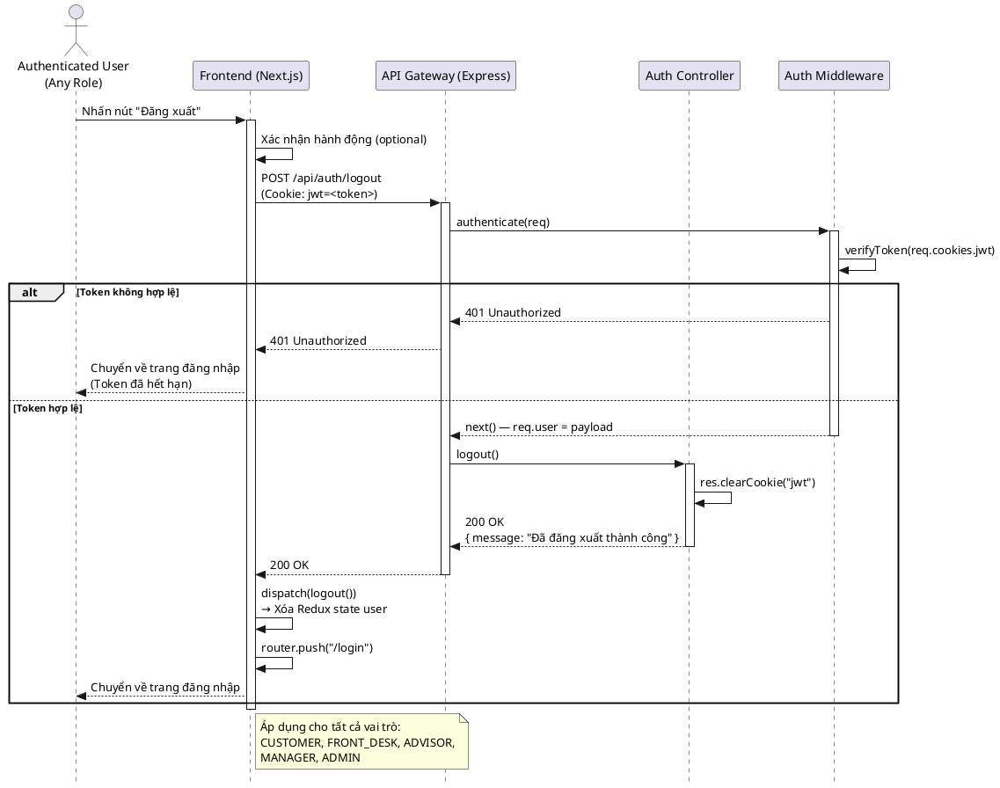

# UC-04: Đăng xuất (Logout) - Sequence Diagram

```plantuml
@startuml
skinparam style strictuml
actor "Authenticated User\n(Any Role)" as user
participant "Frontend (Next.js)" as ui
participant "API Gateway (Express)" as gateway
participant "Auth Controller" as ctrl
participant "Auth Middleware" as mw

user -> ui: Nhấn nút "Đăng xuất"
activate ui

ui -> ui: Xác nhận hành động (optional)

ui -> gateway: POST /api/auth/logout\n(Cookie: jwt=<token>)
activate gateway

gateway -> mw: authenticate(req)
activate mw
mw -> mw: verifyToken(req.cookies.jwt)
alt Token không hợp lệ
    mw --> gateway: 401 Unauthorized
    gateway --> ui: 401 Unauthorized
    ui --> user: Chuyển về trang đăng nhập\n(Token đã hết hạn)
else Token hợp lệ
    mw --> gateway: next() — req.user = payload
    deactivate mw

    gateway -> ctrl: logout()
    activate ctrl
    ctrl -> ctrl: res.clearCookie("jwt")
    ctrl --> gateway: 200 OK\n{ message: "Đã đăng xuất thành công" }
    deactivate ctrl
    gateway --> ui: 200 OK
    deactivate gateway

    ui -> ui: dispatch(logout())\n→ Xóa Redux state user
    ui -> ui: router.push("/login")
    ui --> user: Chuyển về trang đăng nhập
end

deactivate ui

note right of ui
  Áp dụng cho tất cả vai trò:
  CUSTOMER, FRONT_DESK, ADVISOR,
  MANAGER, ADMIN
end note

@enduml
```
