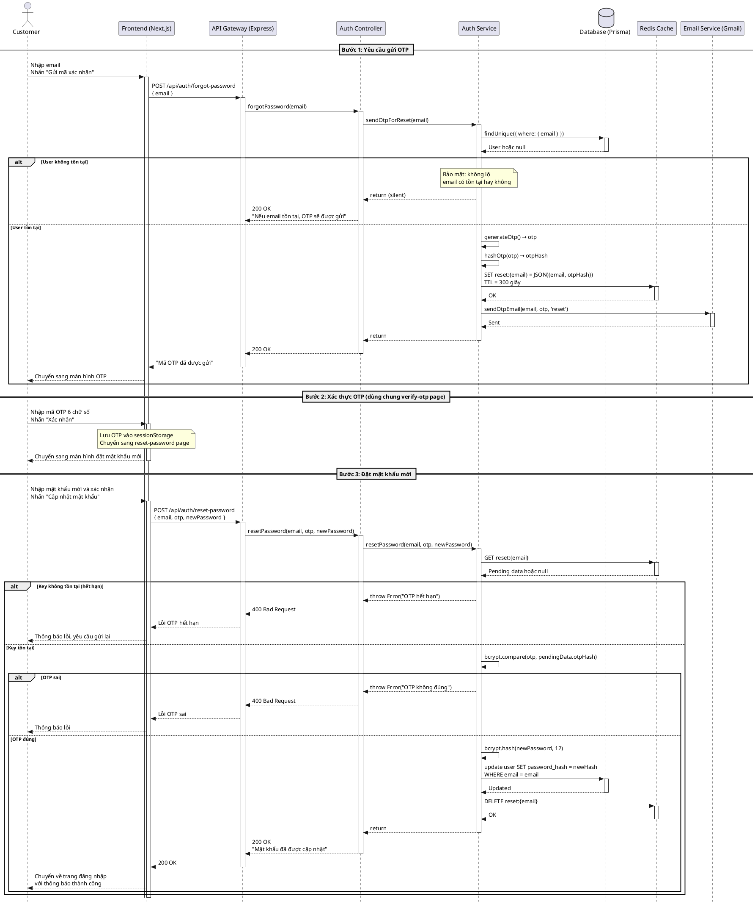

# UC-05: Đặt lại mật khẩu (Reset Password) - Sequence Diagram

```plantuml
@startuml
skinparam style strictuml
actor "Customer" as user
participant "Frontend (Next.js)" as ui
participant "API Gateway (Express)" as gateway
participant "Auth Controller" as ctrl
participant "Auth Service" as svc
database "Database (Prisma)" as db
participant "Redis Cache" as redis
participant "Email Service (Gmail)" as mail

== Bước 1: Yêu cầu gửi OTP ==

user -> ui: Nhập email\nNhấn "Gửi mã xác nhận"
activate ui

ui -> gateway: POST /api/auth/forgot-password\n{ email }
activate gateway

gateway -> ctrl: forgotPassword(email)
activate ctrl

ctrl -> svc: sendOtpForReset(email)
activate svc

svc -> db: findUnique({ where: { email } })
activate db
db --> svc: User hoặc null
deactivate db

alt User không tồn tại
    note over svc: Bảo mật: không lộ\nemail có tồn tại hay không
    svc --> ctrl: return (silent)
    ctrl --> gateway: 200 OK\n"Nếu email tồn tại, OTP sẽ được gửi"
else User tồn tại
    svc -> svc: generateOtp() → otp
    svc -> svc: hashOtp(otp) → otpHash
    svc -> redis: SET reset:{email} = JSON({email, otpHash})\nTTL = 300 giây
    activate redis
    redis --> svc: OK
    deactivate redis
    svc -> mail: sendOtpEmail(email, otp, 'reset')
    activate mail
    mail --> svc: Sent
    deactivate mail
    svc --> ctrl: return
    deactivate svc
    ctrl --> gateway: 200 OK
    deactivate ctrl
    gateway --> ui: "Mã OTP đã được gửi"
    deactivate gateway
    ui --> user: Chuyển sang màn hình OTP
end

== Bước 2: Xác thực OTP (dùng chung verify-otp page) ==

user -> ui: Nhập mã OTP 6 chữ số\nNhấn "Xác nhận"
activate ui
note over ui: Lưu OTP vào sessionStorage\nChuyển sang reset-password page
ui --> user: Chuyển sang màn hình đặt mật khẩu mới
deactivate ui

== Bước 3: Đặt mật khẩu mới ==

user -> ui: Nhập mật khẩu mới và xác nhận\nNhấn "Cập nhật mật khẩu"
activate ui

ui -> gateway: POST /api/auth/reset-password\n{ email, otp, newPassword }
activate gateway

gateway -> ctrl: resetPassword(email, otp, newPassword)
activate ctrl

ctrl -> svc: resetPassword(email, otp, newPassword)
activate svc

svc -> redis: GET reset:{email}
activate redis
redis --> svc: Pending data hoặc null
deactivate redis

alt Key không tồn tại (hết hạn)
    svc --> ctrl: throw Error("OTP hết hạn")
    ctrl --> gateway: 400 Bad Request
    gateway --> ui: Lỗi OTP hết hạn
    ui --> user: Thông báo lỗi, yêu cầu gửi lại
else Key tồn tại
    svc -> svc: bcrypt.compare(otp, pendingData.otpHash)
    alt OTP sai
        svc --> ctrl: throw Error("OTP không đúng")
        ctrl --> gateway: 400 Bad Request
        gateway --> ui: Lỗi OTP sai
        ui --> user: Thông báo lỗi
    else OTP đúng
        svc -> svc: bcrypt.hash(newPassword, 12)
        svc -> db: update user SET password_hash = newHash\nWHERE email = email
        activate db
        db --> svc: Updated
        deactivate db
        svc -> redis: DELETE reset:{email}
        activate redis
        redis --> svc: OK
        deactivate redis
        svc --> ctrl: return
        deactivate svc
        ctrl --> gateway: 200 OK\n"Mật khẩu đã được cập nhật"
        deactivate ctrl
        gateway --> ui: 200 OK
        deactivate gateway
        ui --> user: Chuyển về trang đăng nhập\nvới thông báo thành công
    end
end

deactivate ui

@enduml
```
