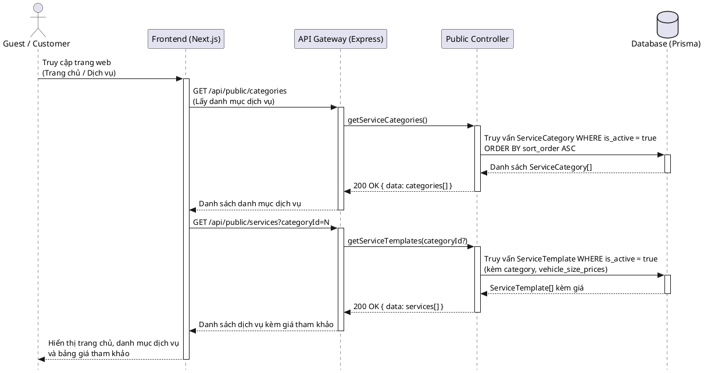

# UC-01: Xem thông tin và danh mục dịch vụ (Browse Website) - Sequence Diagram

```plantuml
@startuml
skinparam style strictuml
actor "Guest / Customer" as user
participant "Frontend (Next.js)" as ui
participant "API Gateway (Express)" as gateway
participant "Public Controller" as ctrl
database "Database (Prisma)" as db

user -> ui: Truy cập trang web\n(Trang chủ / Dịch vụ)
activate ui

ui -> gateway: GET /api/public/categories\n(Lấy danh mục dịch vụ)
activate gateway
gateway -> ctrl: getServiceCategories()
activate ctrl
ctrl -> db: Truy vấn ServiceCategory WHERE is_active = true\nORDER BY sort_order ASC
activate db
db --> ctrl: Danh sách ServiceCategory[]
deactivate db
ctrl --> gateway: 200 OK { data: categories[] }
deactivate ctrl
gateway --> ui: Danh sách danh mục dịch vụ
deactivate gateway

ui -> gateway: GET /api/public/services?categoryId=N
activate gateway
gateway -> ctrl: getServiceTemplates(categoryId?)
activate ctrl
ctrl -> db: Truy vấn ServiceTemplate WHERE is_active = true\n(kèm category, vehicle_size_prices)
activate db
db --> ctrl: ServiceTemplate[] kèm giá
deactivate db
ctrl --> gateway: 200 OK { data: services[] }
deactivate ctrl
gateway --> ui: Danh sách dịch vụ kèm giá tham khảo
deactivate gateway

ui --> user: Hiển thị trang chủ, danh mục dịch vụ\nvà bảng giá tham khảo
deactivate ui

@enduml
```
