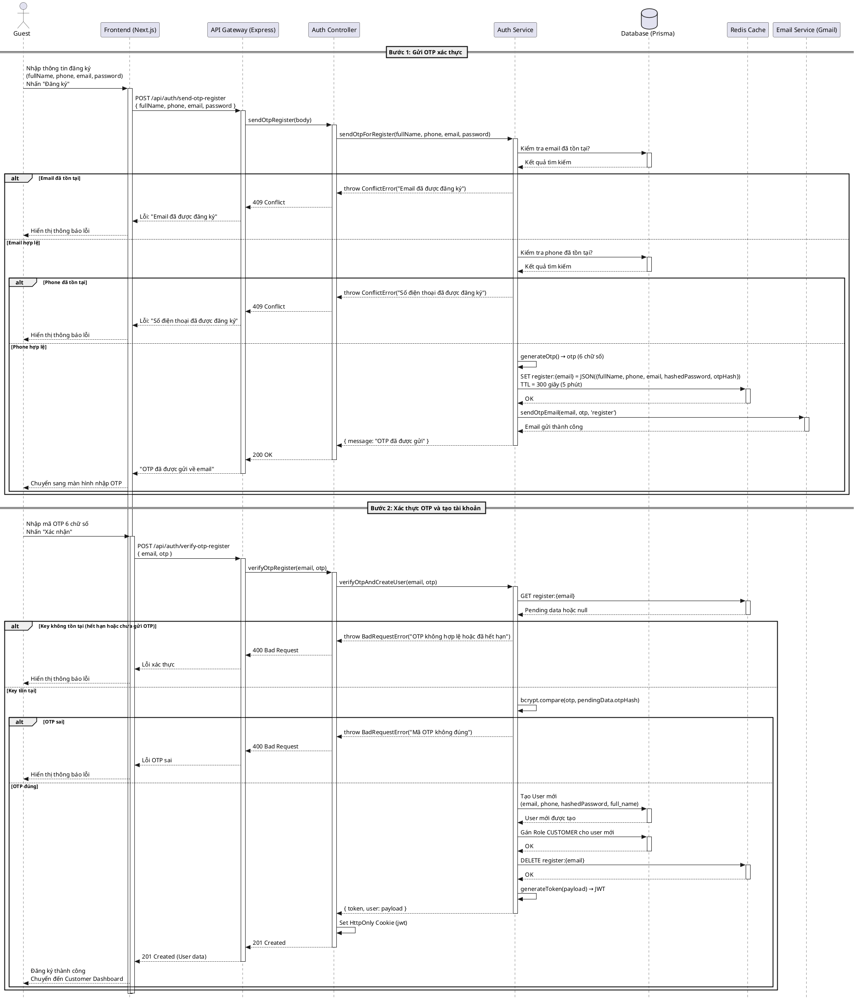

# UC-02: Đăng ký tài khoản (Register) - Sequence Diagram

```plantuml
@startuml
skinparam style strictuml
actor "Guest" as user
participant "Frontend (Next.js)" as ui
participant "API Gateway (Express)" as gateway
participant "Auth Controller" as ctrl
participant "Auth Service" as svc
database "Database (Prisma)" as db
participant "Redis Cache" as redis
participant "Email Service (Gmail)" as mail

== Bước 1: Gửi OTP xác thực ==

user -> ui: Nhập thông tin đăng ký\n(fullName, phone, email, password)\nNhấn "Đăng ký"
activate ui

ui -> gateway: POST /api/auth/send-otp-register\n{ fullName, phone, email, password }
activate gateway

gateway -> ctrl: sendOtpRegister(body)
activate ctrl

ctrl -> svc: sendOtpForRegister(fullName, phone, email, password)
activate svc

svc -> db: Kiểm tra email đã tồn tại?
activate db
db --> svc: Kết quả tìm kiếm
deactivate db

alt Email đã tồn tại
    svc --> ctrl: throw ConflictError("Email đã được đăng ký")
    ctrl --> gateway: 409 Conflict
    gateway --> ui: Lỗi: "Email đã được đăng ký"
    ui --> user: Hiển thị thông báo lỗi
else Email hợp lệ

    svc -> db: Kiểm tra phone đã tồn tại?
    activate db
    db --> svc: Kết quả tìm kiếm
    deactivate db

    alt Phone đã tồn tại
        svc --> ctrl: throw ConflictError("Số điện thoại đã được đăng ký")
        ctrl --> gateway: 409 Conflict
        gateway --> ui: Lỗi: "Số điện thoại đã được đăng ký"
        ui --> user: Hiển thị thông báo lỗi
    else Phone hợp lệ
        svc -> svc: generateOtp() → otp (6 chữ số)
        svc -> redis: SET register:{email} = JSON({fullName, phone, email, hashedPassword, otpHash})\nTTL = 300 giây (5 phút)
        activate redis
        redis --> svc: OK
        deactivate redis
        svc -> mail: sendOtpEmail(email, otp, 'register')
        activate mail
        mail --> svc: Email gửi thành công
        deactivate mail
        svc --> ctrl: { message: "OTP đã được gửi" }
        deactivate svc
        ctrl --> gateway: 200 OK
        deactivate ctrl
        gateway --> ui: "OTP đã được gửi về email"
        deactivate gateway
        ui --> user: Chuyển sang màn hình nhập OTP
    end
end

== Bước 2: Xác thực OTP và tạo tài khoản ==

user -> ui: Nhập mã OTP 6 chữ số\nNhấn "Xác nhận"
activate ui

ui -> gateway: POST /api/auth/verify-otp-register\n{ email, otp }
activate gateway

gateway -> ctrl: verifyOtpRegister(email, otp)
activate ctrl

ctrl -> svc: verifyOtpAndCreateUser(email, otp)
activate svc

svc -> redis: GET register:{email}
activate redis
redis --> svc: Pending data hoặc null
deactivate redis

alt Key không tồn tại (hết hạn hoặc chưa gửi OTP)
    svc --> ctrl: throw BadRequestError("OTP không hợp lệ hoặc đã hết hạn")
    ctrl --> gateway: 400 Bad Request
    gateway --> ui: Lỗi xác thực
    ui --> user: Hiển thị thông báo lỗi
else Key tồn tại
    svc -> svc: bcrypt.compare(otp, pendingData.otpHash)
    alt OTP sai
        svc --> ctrl: throw BadRequestError("Mã OTP không đúng")
        ctrl --> gateway: 400 Bad Request
        gateway --> ui: Lỗi OTP sai
        ui --> user: Hiển thị thông báo lỗi
    else OTP đúng
        svc -> db: Tạo User mới\n(email, phone, hashedPassword, full_name)
        activate db
        db --> svc: User mới được tạo
        deactivate db
        svc -> db: Gán Role CUSTOMER cho user mới
        activate db
        db --> svc: OK
        deactivate db
        svc -> redis: DELETE register:{email}
        activate redis
        redis --> svc: OK
        deactivate redis
        svc -> svc: generateToken(payload) → JWT
        svc --> ctrl: { token, user: payload }
        deactivate svc
        ctrl -> ctrl: Set HttpOnly Cookie (jwt)
        ctrl --> gateway: 201 Created
        deactivate ctrl
        gateway --> ui: 201 Created (User data)
        deactivate gateway
        ui --> user: Đăng ký thành công\nChuyển đến Customer Dashboard
    end
end

deactivate ui

@enduml
```
