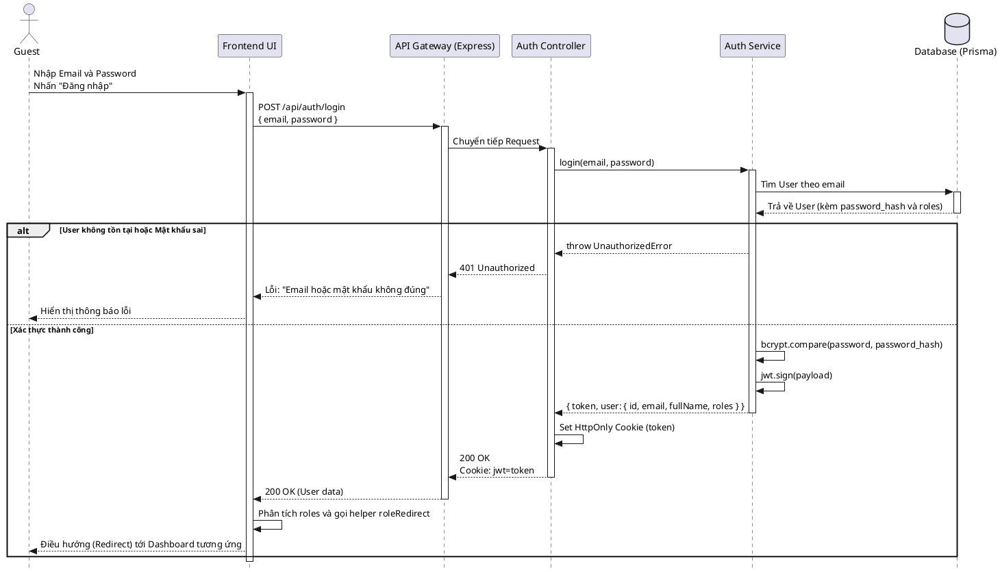

# UC-03: Đăng nhập (Login) - Sequence Diagram

```plantuml
@startuml
skinparam style strictuml
actor "Guest" as user
participant "Frontend UI" as ui
participant "API Gateway (Express)" as gateway
participant "Auth Controller" as ctrl
participant "Auth Service" as svc
database "Database (Prisma)" as db

user -> ui: Nhập Email và Password\nNhấn "Đăng nhập"
activate ui
ui -> gateway: POST /api/auth/login\n{ email, password }
activate gateway

gateway -> ctrl: Chuyển tiếp Request
activate ctrl

ctrl -> svc: login(email, password)
activate svc

svc -> db: Tìm User theo email
activate db
db --> svc: Trả về User (kèm password_hash và roles)
deactivate db

alt User không tồn tại hoặc Mật khẩu sai
    svc --> ctrl: throw UnauthorizedError
    ctrl --> gateway: 401 Unauthorized
    gateway --> ui: Lỗi: "Email hoặc mật khẩu không đúng"
    ui --> user: Hiển thị thông báo lỗi
else Xác thực thành công
    svc -> svc: bcrypt.compare(password, password_hash)
    svc -> svc: jwt.sign(payload)
    svc --> ctrl: { token, user: { id, email, fullName, roles } }
    deactivate svc
    
    ctrl -> ctrl: Set HttpOnly Cookie (token)
    ctrl --> gateway: 200 OK\nCookie: jwt=token
    deactivate ctrl
    
    gateway --> ui: 200 OK (User data)
    deactivate gateway
    
    ui -> ui: Phân tích roles và gọi helper roleRedirect
    ui --> user: Điều hướng (Redirect) tới Dashboard tương ứng
end
deactivate ui

@enduml
```
