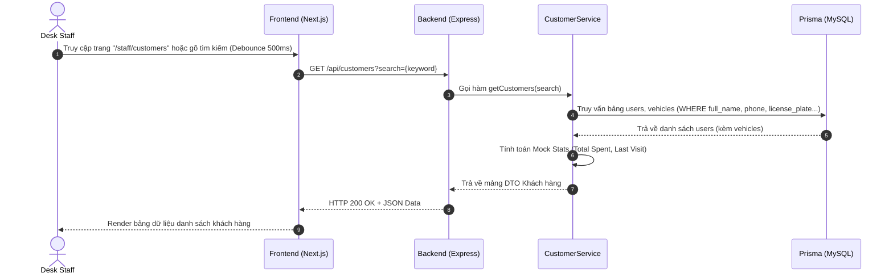
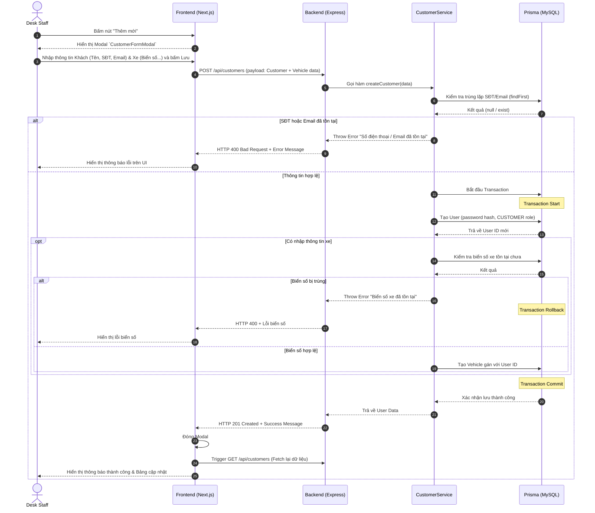
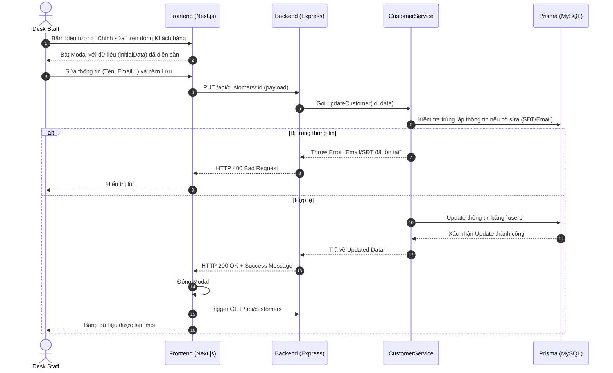

# Thiết kế Sequence Diagram - UC-13 (Quản lý Hồ sơ Khách hàng)

Sơ đồ trình tự (Sequence Diagram) mô tả luồng tương tác giữa Người dùng (Desk Staff), Giao diện Frontend, Backend API và Cơ sở dữ liệu cho 2 tác vụ chính: **Tìm kiếm khách hàng** và **Thêm mới/Cập nhật khách hàng**.

## 1. Tìm kiếm và Xem danh sách Khách hàng

## 2. Thêm mới Khách hàng & Phương tiện (Tạo mới)

## 3. Chỉnh sửa thông tin Khách hàng

